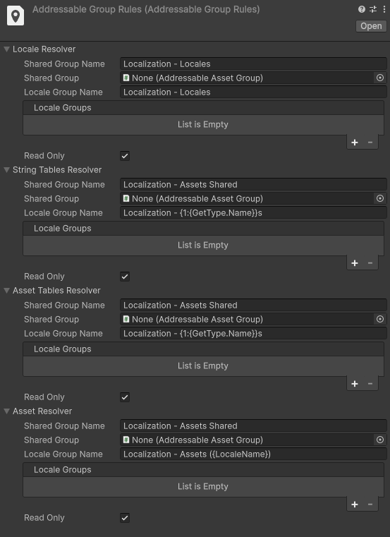
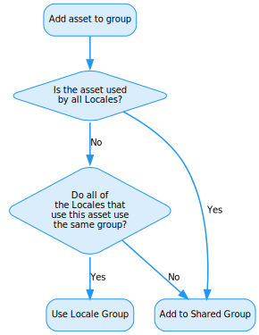
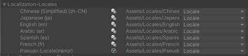
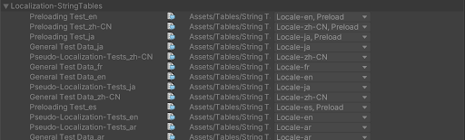
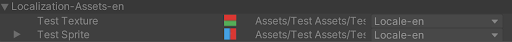
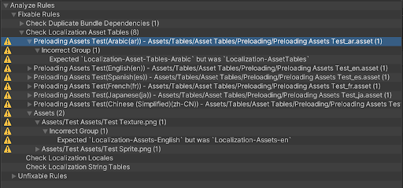

# Addressables Integration

The Localization package uses the [Addressables Assets system](https://docs.unity3d.com/Packages/com.unity.addressables@latest) to manage assets, including Locales, String Tables and Asset Tables.

You can place Assets into different Addressable groups based on criteria such as asset type or the Locales that depend on it.

## Addressable Group Rules

To configure the group rules, create an [Addressable Group Rules](xref:UnityEditor.Localization.Addressables.AddressableGroupRules) asset (**Assets > Create > Localization > Addressable Group Rules**).
Some examples of different rule sets are:

- Using a single group for all assets.
- Creating a group for each Locale and a group for shared assets.
- Creating Groups for each asset type (String Tables, Textures, Audio).
- Creating Region groups to collate assets from similar regions (Europe, Asia, Latin America).
- Using a group for each game, when a project contains multiple games.

### Group Resolver

By default each rule set will use a **GroupResolver**. To create more complex rules, create a custom class. 

The Group Resolver uses the following rules to pick a group:

| **Property**          | **Description** |
| --------------------- | --------------- |
| **Shared Group Name** | This group contains assets that are used by all Locales (Shared Table Data) and which don’t share a  Common or Region Locale group. For example, assets that are used by multiple Locales belong in this group. When an asset is added, a group with a matching name will be used or a new one will be created. |
| **Shared Group**      | When a group is set directly with an Addressable Asset Group Asset, this value replaces the **Shared Group Name**. |
| **Locale Group Name** | The Locale Group Name is a Smart String that can be used to generate a name specific to the Locale or asset.  2 arguments are passed into the Smart Format operation:<ul><li>Arg 0: The Locale asset.</li><li>Arg 1: The Asset being added.</li></ul> For example, an Audio Clip added to Welsh would with the rule `“{1:{GetType.Name}} Assets - {LocaleName} ({Identifier.Code})”` would use the group `“AudioClip Assets - Welsh (cy)”`. |
| **Locale Groups**     | You can add a specific group for each Locale in the project. When a Locale exists, this value will be used instead of the Locale Group Name.  You can also use the same group for multiple Locales, such as for a regional group. If an asset is used by multiple Locales and all of the Locales use the same group, then this value will be used instead of the Shared Group. |
| **Read Only**         | To mark newly created groups as read only, enable this option. Read only groups can not be modified through the Addressables Group Window. |

## Locales

By default, Locales are stored within a separate Addressables Group called **Localization-Locales**.

Locales are discovered by searching for all Locale assets that have the **Locale** label.
It is safe to move Locales into different Addressable Groups and to change their Addressable Name, but do not remove the Locale label or the Locale will not be discoverable in the player.

## String Table & Asset Table Collections

Collections have 2 parts; a Table, and the Shared Table Data.  Each Locale has a table, and all tables in the collection use the same Shared Table Data.

By default, The Shared Table data asset is stored in a group called **Localization-Assets-Shared**. The Table is stored in a group for its Locale with the name structure of **Localization-String-Tables-{LocaleName}** for String Tables or **Localization-Asset-Tables-{LocaleName}** for Asset Tables.

Shared Table data assets have no special Addressable characteristics, they are resolved through their asset Guid at runtime. It is safe to modify all Addressable properties for the Shared Table data.

Tables contain a Label for the Locale it represents in the form **Locale-{Code}**. If a String Table is marked as Preload then it will also contain the **Preload** label. At runtime, preloading is performed by querying the String Table assets that have both the Preload label and the relevant Locale label. It is safe to add additional Labels, but do not remove or modify the  Locale and Preload labels.

The Localization system uses the **Table Address** when loading the table, so do not modify the Table Address. Table Addresses are in the form **“{TableName}_{Code}”**

## Asset Table Assets

By default, Assets that are part of Asset Tables are stored in a group for the Locale that depends on them, with the name **Localization-Assets-{LocaleName}**. If an asset is used by more than one Locale, it is placed into the **Localization-Assets-Shared** group.

Assets are resolved at runtime via their Guid so it is safe to modify the Address. Assets contain a label for each Locale that depends on them in the form **Locale_{Code}**. The Labels are used to track asset usage in the Editor and are not used in the Player, however removing them may cause assets to be placed into incorrect groups.

## Legacy Support

Prior to version **0.11.0**, localization assets were stored using different default group rules.The Legacy ruletset can be created In order to maintain this structure, such as when upgrading a project built using a version before 0.11.0 . Create a Legacy rule set by navigating to **Assets > Create > Localization > Addressable Group Rules(Legacy)**.

## Addressable Analyzers

To fix an Addressables issue, or upgrade a project when the Addressable Group rules have been modified, use Addressable Analyzers. Find the Addressable Analyzers in the Analyzer window (**Window > Asset Management > Addressables > Analyze**)

After an analyzer has been run, it produces a report of any issues that have been found and the severity of those issues. The issues can then be automatically fixed by selecting the **Fix Selected Rules** button.

_Example of running the Check Asset Tables analyzer._

There are 3 Localization Analyzers:

- **Check Localization Locales**. This rule checks that all Locales in the project are marked as Addressable, contain the Locale label and are in the group defined by the Addressable Group Rules.
- **Check Localization String Tables**. This rule checks that the String Tables and their Shared Table Data are contained in the groups defined by Addressable Group Rules, and have the expected Labels and Addresses.
- **Check Localization Asset Tables**. This rule checks that the Asset Tables and their Shared Table Data are contained in the groups defined by Addressable Group Rules, and have the expected Labels and Addresses. This rule also checks that all assets referenced by the tables are in the expected groups and contain the correct labels.