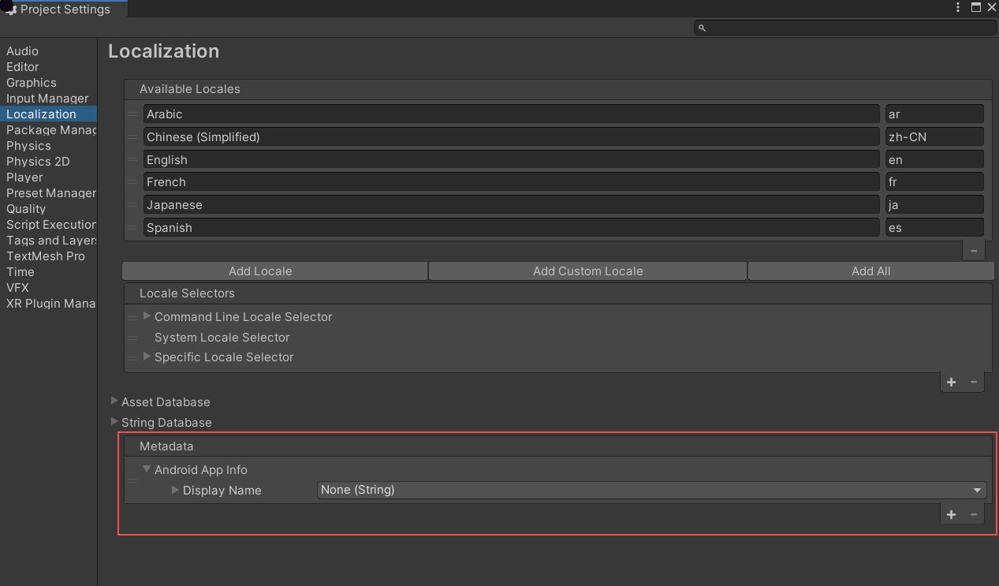
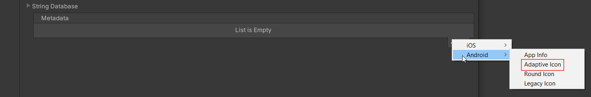
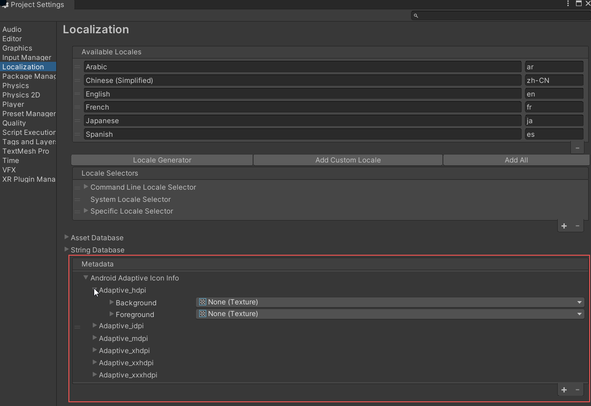
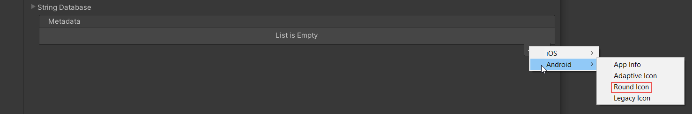
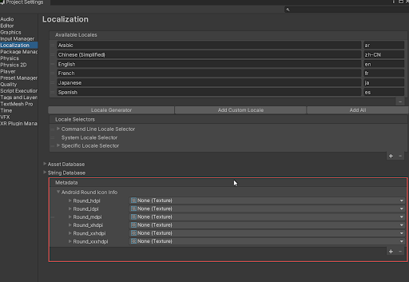
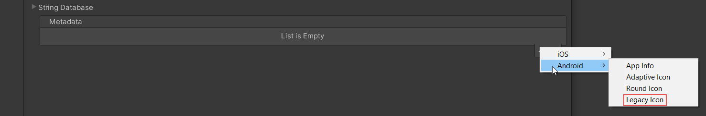
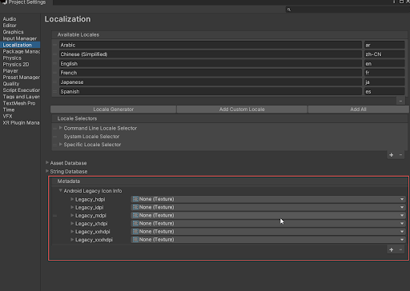

# Android App Localization

## App Name

The Localization package supports localizing app names with the Android **strings.xml** file. When you build the Android player, the package applies the Localization values to the Gradle project during the post-build step.

The Gradle project is populated with folders named respective to the project locales, and a **strings.xml** file is added for each Locale. For more information, refer to [Android localization documentation](https://developer.android.com/guide/topics/resources/localization).

To configure the App localization, add **Android/App Info Metadata** to the Localization Settings **Metadata**.

The Localization package currently only supports App name Localization in Android:
Values that are not set are left unlocalized and use their default values.

| **Name**         | **Android Attribute** | **Description** |
| ---------------- | --------------------- | --------------- |
| **Display Name** | android:label         | The user-visible name for the bundle, used by Google Assistant and visible on the Android Home screen.

## Icon

The localization package supports the localization of app icons in Android applications. When you build the Android player, the package applies the Localization values to the Gradle project during the post-build step.

The Gradle project is populated with folders named respective to the project locales, and the images are copied depending on the type of icon selected for each Locale. The Localization package currently supports the Adaptive Icon, Round Icon, and Legacy Icon for the Android platform.

To configure the App Icon localization, add any one or more of the icon metadata to the Localization Settings **Metadata**.

### Adaptive Icon

The Adaptive Icon metadata represents the application icon on the device's Home Screen and in the launcher window on devices running **Android 8** and above.

It supports all the six density qualifiers for an Android app icon, from high-density (hdpi) screens (~240dpi) to extra-extra-extra-high-density (xxxhdpi) screens (~640dpi).

It also supports the Adaptive Icon sub-attributes, the background and foreground icons which are used for displaying the App icon on devices that are running **API level 26** and above.

For more information on the Adaptive Icon, refer to the [Android adaptive icon documentation](https://developer.android.com/guide/practices/ui_guidelines/icon_design_adaptive).

To add an Adaptive Icon, add the **Android/Adaptive Icon Metadata**.

### Round Icon

The Round Icon metadata represents the application icon on the device's Home Screen and in the launcher window on devices running **Android 7** and above.

It supports all the six density qualifiers for Android app icon, from high-density (hdpi) screens (~240dpi) to extra-extra-extra-high-density (xxxhdpi) screens (~640dpi).

For more information on the Round Icon, refer to [Android circular icons documentation](https://developer.android.com/about/versions/nougat/android-7.1.html#circular-icons).

To add a Round Icon, add the **Android/Round Icon Metadata**.

### Legacy Icon

For devices running **Android 7** and below, the Localisation package uses the Legacy Icon Metadata. It is used as the application icon on the device's Home Screen and in the launcher window.

It supports all the six density qualifiers for Android app icon, from high-density (hdpi) screens (~240dpi) to extra-extra-extra-high-density (xxxhdpi) screens (~640dpi).

For more details on density qualifiers, refer to the [Android density qualifier documentation](https://developer.android.com/training/multiscreen/screendensities#TaskProvideAltBmp).

To add a Legacy Icon, add the **Android/Legacy Icon Metadata**.

## Configure through script

You can also configure the App Info via script. You must complete the configuration before the application is built, otherwise, the changes will not be applied.

[!code-cs]
