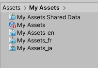
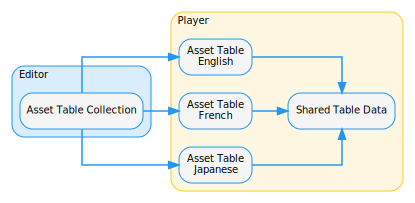
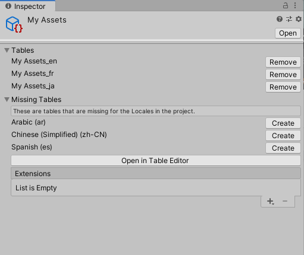

# Asset Tables

An Asset Table returns an asset when requested via a **Key** (an identifying name or unique id) for a specific Locale. An entry in an Asset Table contains a **Key Id** and the GUID of the referenced asset that will be used to load it via the Addressables system. An Asset Table entry can reference any Unity asset.

## Asset Table Collection

An Asset Table Collection is an Editor only asset. It provides an interface to one or more Asset Tables that all share the same Shared Table Data and Table Collection Name. You can use the Asset Table Collection to add and remove assets from its associated Asset Tables through the Editor or via script.

When you create a new Asset Table Collection, Unity creates an Asset Table Collection asset and an Asset Table asset for each Locale, and a single Shared Table Data asset that the Asset Tables reference. The Shared Table Data asset stores all the key names and associated Id values, as well as Shared Metadata (metadata that all Asset Tables can access).

Extensions are Editor only data that you can attach to a Table Collection. An Extension can contain additional data that you wish to associate with the collection, or it can add functionality such as an importer or exporter for a particular file format or service.

To create custom Extensions, you can inherit from [CollectionExtension](xref:UnityEditor.Localization.CollectionExtension) and add the [AssetTableCollectionExtensionAttribute](xref:UnityEditor.Localization.AssetTableCollectionExtensionAttribute).

## Preloading

By default, the Localization system does not pre-load an Asset Table and its contents. This means that the first time Unity requests an asset, the Localization system must load the table and then the requested asset. This happens asynchronously in the background; however, it means that the requested asset might not be immediately available.

You can configure the Localization system to pre-load assets, so that they are immediately available upon request. To do this, navigate to the Asset Tables window, click the **Table Properties** button (above the Locale name) and enable **Preload All Tables** to preload all tables in this collection, or **Preload Table** to only preload the selected table.

## Metadata

You can view [Metadata](Metadata.md) for tables and table entries.

- To view Metadata for a table, select the button above the table column header.
- To view Metadata for a table entry, select the button in the table entry cell.

The Localization system stores **Shared** Metadata in the **Shared Table Data** for the table collection. This means that all Tables have access to this data. Locale-specific Metadata (the list below **Shared**) is stored in the table and is only accessible by the table with the data.

