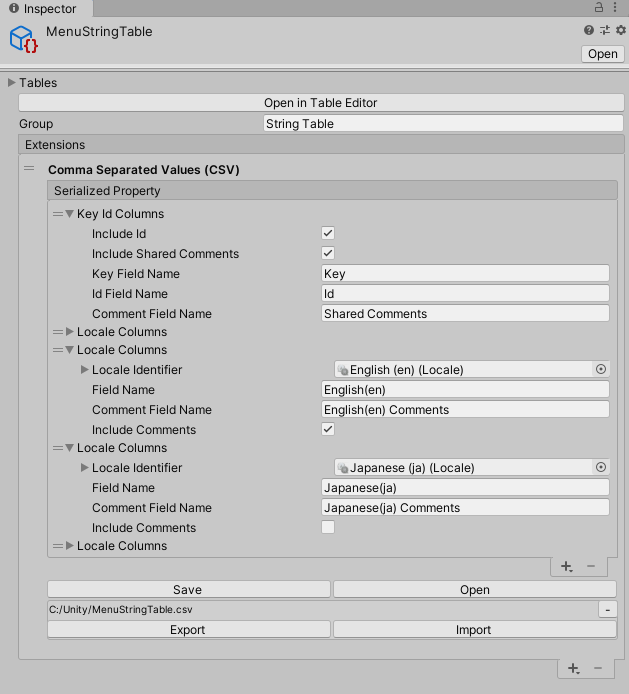
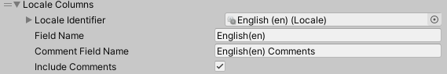

# Importing and exporting CSV files

You can use the CSV (Comma Separated Values) format to import and export [String Table Collections](StringTables.md). This makes it easier to work with translators who use CSV for translation; you can export String Table Collections from Unity to CSV files, send them to the translator for modification, and then re-import the modified files back into Unity.

## Exporting to CSV

You can export CSV files from the String Table window, the String Table Collection window, and the Localization window.

The type of export depends on where you run the export from:

- **String Table window:** This exports values for the selected String Table only.
- **String Table Collection window:** This exports all values for the selected String Table Collection.
- **Localization window:** This exports all values for the selected String Table Collection.

To export to CSV, select the vertical ellipsis (⋮) and go to **Export**. Select **CSV** to export only the current localized values, or **CSV (With Comments)** to also export any Comment metadata as separate columns for the shared comments and each Locale.

A **CSV** export represents the String Table it is based on; each row represents a string, and it contains the following columns:

- **Key:** The Key that you have assigned to that string.
- **Id:**  The ID that Unity has assigned to that string.
- Locales: A CSV file has one column for each Locale included in the String Table.

A **CSV (With Comments)** export also contains an additional column for each Locale, which includes comment metadata.

### Example CSV structures

Example CSV structure when exporting English and French:

| **Key**     | **Id** | **English(en)** | **French(fr)**    |
|-------------|--------|-----------------|-------------------|
| EXAMPLE_KEY | 1      | Example text.   | Exemple de texte. |
| GREETING    | 2      | Hello.          | Bonjour.          |

Example CSV structure when exporting English and French with comments:

| **Key**     | **Id** | **Shared Comments** | **English(en)** | **English(en) Comments**  | **French(fr)**    | **French(fr) Comments**  |
| ----------- | ------ | ------------------- | --------------- | ------------------------- | ----------------- | ------------------------ |
| EXAMPLE_KEY | 1      | Example comments.   | Example text.   | Example comments.         | Exemple de texte. | Example comments.        |
| GREETING    | 2      | Greeting text.      | Hello.          | Greeting text in English. | Bonjour.          | Greeting text in French. |

## Importing from CSV

You can import CSV files via the String Table window, the String Table Collection window, and the Localization window.

The type of import depends on where you import the file to:

- **String Table window:** This imports values for the selected String Table only.
- **String Table Collection window:** This imports all values for the selected String Table Collection.
- **Localization window:** This imports all values for the selected String Table Collection.

To import from CSV:

1. Select the vertical ellipsis (⋮).
2. Go to **Import** and select either:
   - **CSV** to replace the contents.
   - **CSV(Merge)** to only update the entries in the CSV.
3. Select the CSV file from your file explorer.

CSV data must contain a **Key** or **Id** column. All other columns are optional.

When importing new entries, you can leave the **Id** field blank or insert a 0 to inform the Localization system that it needs to assign a new ID to that string.

### Example CSV structure

Example CSV structure when exporting English and French with a new “Welcome” string:

| **Key**     | **Id** | **Shared Comments** | **English(en)** | **English(en) Comments**  | **French(fr)**    | **French(fr) Comments**  |
| ----------- | ------ | ------------------- | --------------- | ------------------------- | ----------------- | ------------------------ |
| EXAMPLE_KEY | 1      | Example comments.   | Example text.   | Example comments.         | Exemple de texte. | Example comments.        |
| GREETING    | 2      | Greeting text.      | Hello.          | Greeting text in English. | Bonjour.          | Greeting text in French. |
| WELCOME     | 0      | New welcome text.   | Welcome.        | Welcome text in English.  | Bienvenue.        | Welcome text in French.  |

## Comma Separated Values (CSV) extension

For detailed configuration and control over the import and export of CSVs, you can add the **Comma Separated Values (CSV)** extension to your String Table. You can use this to configure fields in  imported and exported CSV files.

Use the buttons at the bottom of the CSV extension to select, import and export files.

| **Button** | **Description**                                                                                                                       |
| ---------- | ------------------------------------------------------------------------------------------------------------------------------------- |
| **Save**   | Save the current configuration as a CSV file.                                                                                         |
| **Open**   | Import a CSV file, and populate the CSV extension’s fields with that file’s configuration.                                            |
| **Export** | The same as **Save**; however, Unity automatically uses the most recent file you selected with **Save** or **Open** (see Note below). |
| **Import** | The same as **Open**; however, Unity automatically uses the most recent file you selected with **Save** or **Open** (see Note below). |

**Note: Export** and **Import** have the same behavior as **Save** and **Open** respectively; however, Unity uses the most recent file you selected with **Save** or **Open**. This allows you to link the configuration to a file, and then select **Export/Import** without needing to select a file each time.

There are 2 types of column mappings available by default: **Key Id Columns**, and **Locale Columns**. You can also add Custom Columns in the CSV extension.

### Key Id Columns

There must always be a Key Id Column included.

This controls the exporting and importing of the Key, Id(optional) and Shared Comments(optional)

| **Property** | **Description** |
| ------------ | --------------- |
| **Include Id** | Enable this to include the **Id** field in the exported CSV. It’s good practice to enable this if a **Key** value has changed, so that when you re-import the data, the Localization system can match it to the Id and update the Key name. If you do not, the Localization system creates a new key. When you import a CSV file, Unity uses the **Id Field name** value to determine whether the Id field is included. |
| **Include Shared Comments** | Enable this to export Comment metadata that applies to all Locales. This is metadata that is stored in the Shared Table Data. When Importing the Comment Field name will be used to determine if the id field is included. |
| **Key Field Name** | Set the header name of the column that contains Key field values. When you import CSV data, the Localization system uses this value to find the **Key** field in the CSV headers. If it does not find a matching header, it assumes there is no **Key** field. |
| **ID Field name** | Set the header name of the column that contains Id field values. When you import CSV data, the Localization system uses this value to find the **Id** field in the CSV headers. If it does not find a matching header, it assumes there is no **Id** field. |
| **Comment Field Name** | This is the title of the Shared Comments field when exporting. When importing this value is used to find the Shared Comments field in the CSV headers. If a matching header is not found then it is assumed the Shared Comments are not included.  Set the header name of the column that contains Shared Comments field data. When you import CSV data, the Localization system uses this value to find the **Shared Comments** field in the CSV headers. If it does not find a matching header, it assumes there is no **Shared Comments** field. |

### Locale Columns

| **Property**           | **Description**                                                                                                                                                                                                                        |
|------------------------|----------------------------------------------------------------------------------------------------------------------------------------------------------------------------------------------------------------------------------------|
| **Locale Identifier**  | This identifies what Locale this column should be used for. This value is not written or read from CSV.                                                                                                                                |
| **Field Name**         | The name of the value field when exporting. When importing this value is used to find the field in the CSV headers. If a matching header is not found then it is assumed the values are not included.                                  |
| **Comment Field Name** | The name of the Comment field when exporting. When importing this value is used to find the Comments field in the CSV headers. If a matching header is not found then it is assumed the Comments for this Locale are not included.     |
| **Include Comments**   | Enable this to export Comment metadata that applies to this Locale. This is metadata that is stored in the String Table Entry. When Importing the Comment Field name will be used to determine if the id field is included in the CSV. |

### Custom columns

To create custom CSV columns, you can inherit from the [CsvColumns](xref:UnityEditor.Localization.Plugins.CSV.Columns.CsvColumns) class. You can use custom columns to import and export custom data, such as custom metadata.

See the CSV package samples for further details.
