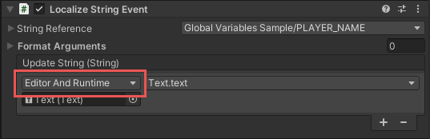
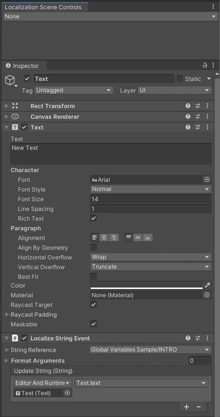

# Edit Mode Support

You can preview a scene’s Localization without entering play mode.
Edit mode support is provided by the Localization Scene Controls window (**Window > Asset Management > Localization Scene Controls**).

Use the dropdown to select a Locale to preview. You can also change the Locale with the Up and Down arrow keys when the dropdown is selected.

When previewing in edit mode, the [Addressables](https://docs.unity3d.com/Manual/com.unity.addressables.html) system is bypassed and assets are accessed directly from the AssetDatabase. Addressable Play mode scripts are not used outside of Play mode.

## Unity Events

[Unity Events](https://docs.unity3d.com/Manual/UnityEvents.html), such as those in the [Localize String Event](ComponentLocalizers.md#localizestringevent) component, should be set as **Editor and Runtime** so that the event is sent whilst previewing in Edit mode and values are updated accordingly.

## Driven Properties

Unity uses the Driven Properties system to apply temporary changes to properties in a scene, without those changes being saved. When using the **LocalizeStringEvent** and **LocalizeAssetEvent** components, the default properties added with the **Localize** menu command are marked as Driven so temporary changes can occur when the Locale is changed. When the Locale is changed back to None, all driven properties will revert back to their original values.

In Unity **2020.2 and above** you can identify the driven properties within the Inspector. Driven properties are disabled and have a color tint applied.
The tint color applied to driven properties can be configured through the **Preferences** window (**Preferences/Colors**) under **Localization/Driven Property**.
The Component Editor must be using **IMGUI** in order for the visual indication to work. UI Toolkit is not currently supported.

You can mark any Serialized property as driven. The following example shows how a script can support both Edit mode and play mode. Use the [EditorPropertyDriver](xref:UnityEngine.Localization.EditorPropertyDriver) to register driven properties. When a property is registered as driven, no changes applied to it will be saved into the scene. You can untrack all properties and revert them to their original values by opening the Scene Controls Window and setting the Locale to **None**, or by going into the script and setting `LocalizationSettings.SelectedLocale` to null.

[!code-cs[editor-property-driver](../DocCodeSamples.Tests/EditorPropertyDriverSamples.cs)]
