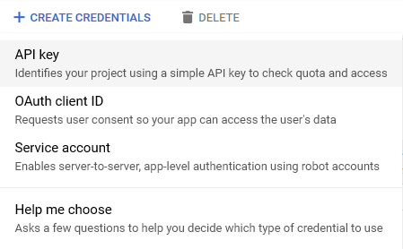
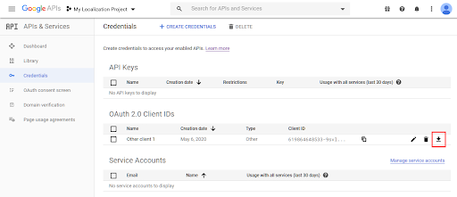
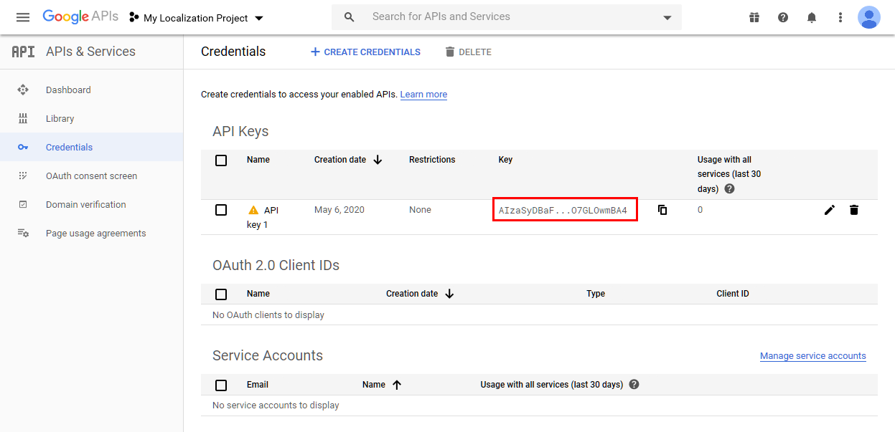
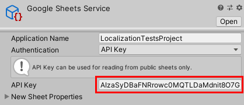

# Configuring Authentication

To gain read and write access from your project to a Google Sheet, you need to have request authorization. For more information on how to obtain this, see [Google Sheets documentation: Authorizing Requests](https://developers.google.com/sheets/api/guides/authorizing).

## Creating Credentials

To set up OAuth or API Key authorization, follow these steps:

1. Visit [Google API Console](https://console.developers.google.com/) and select the **Credentials** section under **APIs & Services**. This opens [Google APIs: Credentials](https://console.developers.google.com/apis/api/sheets.googleapis.com/overview)

    

2. Select your Google APIs and Services project for your Unity application. If you do not have a Google APIs and Services project yet, select **CREATE PROJECT** to create one.

3. Enable the Google Sheets API support. To do this, go to [Google APIs: Credentials](https://console.developers.google.com/apis/api/sheets.googleapis.com/overview)

    

4. Select the **CREATE CREDENTIALS** option and select either **API Key** or **OAuth Client ID**.

    

## OAuth

OAuth 2.0 authentication is required in order to read and write from a public or private sheet. For more information, see [Google’s OAuth 2.0 documentation](https://developers.google.com/identity/protocols/OAuth2).

In most cases when generating OAuth credentials, you should set the application type to **Desktop**, because you will only use the service through the Unity Editor.

To add the OAuth credentials to the Sheets Service Provider, you can either input them manually or load them from the *credentials* JSON file. To input them manually, fill in the **Client Id** and **Client Secret** values To download the credentials, download the JSON file, then choose **Load Credentials** and use the file browser to select it.

To generate an authorization token, select **Authorize**. Unity launches your web browser and opens a Google authentication page; log in with Google and allow Unity access to the account. This ensures your project does not need to make any further authorization requests until the token expires. If you do not click **Authorize** when you first set up a Sheets Service Provider Asset, then Unity opens the web browser the first time it attempts to connect to the Google sheet.

When you authorize in the web browser, you must select the option to grant Unity access to `See, edit, create, and delete all your Google Sheets spreadsheets`. If you do not grant access, Unity reports a `TokenResponseException` error when it tries to access your sheet.

## API Key

API keys are a simple encrypted string that you can use when you only want to access data on public Google Sheets. The key identifies your project and provides API access, quota, and reports.
API keys can only read data, and cannot make changes or create new sheets.
When you generate an API Key, copy the generated key into the Sheets Service Provider API Key field.

