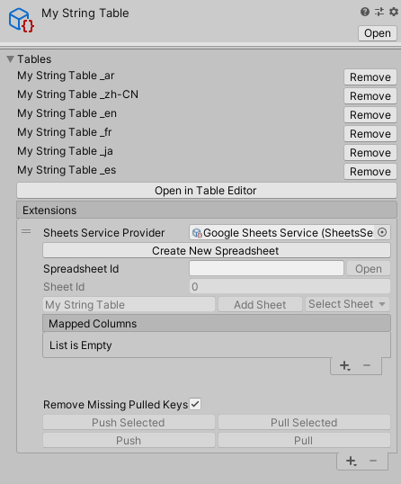
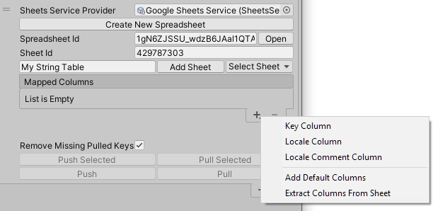
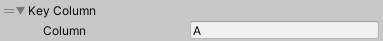
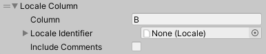
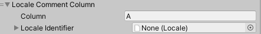

# Syncing String Table Collections

For each String Table Collection you want to connect to a Google Sheet, you need to add a Google Sheet extension to the String Table Collection’s **Extensions list**. To do this, click the **Add(+)** button in the **Extensions** field. It is possible to add multiple extensions to a String Table Collection (for example, you might want to have a different sheet for each locale, and therefore a Google Sheet Extension for each sheet).

To sync a String Table to a Google Sheet, you need to connect it to a Sheets Service Provider asset. See [Sheets Service Provider](Google-Sheets-Sheets-Service-Provider.md) for information on creating and configuring one.



| **Property**                        | **Description** |
| ----------------------------------- | --------------- |
| **Sheets Service Provider**         | Assign the [Sheets Service Provider](Google-Sheets-Sheets-Service-Provider.md) Asset you want to use.
| **Create New Spreadsheet**          | Select this button to create a new spreadsheet for String Table data. Use this if a Google Sheet for this String Table does not already exist.
| **Spreadsheet Id**                  | Enter the Spreadsheet ID from your Google Spreadsheet. In the Spreadsheet’s Google URL, this is in the middle of the URL:<br><br>https://<span>docs.google.</span>com/spreadsheets/d/**spreadsheetId**/edit#gid=sheetId
| **Sheet Id**                        | Enter the Sheet ID from your Google Spreadsheet. In the Sheet’s Google URL, this is in the middle of the URL:<br><br>https://<span>docs.google.</span>com/spreadsheets/d/spreadsheetId/edit#gid=**sheetId**
| **Add Sheet**                       | Create a new sheet based on the properties defined in the associated Sheets Service Provider’s New Sheet Properties.
| **Select Sheet**                    | Select a sheet from the Google Spreadsheet.
| **Mapped Columns**                  | Assign specific types of data to specific columns. See **Mapped Columns**, below, for details.
| **Remove Missing Pulled Keys**      | Remove any keys that are not present in a sheet after a pull.
| **Push Selected**                   | Push selected mapped columns to the Google sheet.
| **Pull Selected**                   | Pull selected mapped columns from the Google sheet.
| **Push**                            | Push all mapped columns to the Google sheet.
| **Pull**                            | Pull all mapped columns from the Google sheet.

## Mapped Columns

Use the **Mapped Columns** field to configure how your project pushes and pulls data from the spreadsheet. A mapped column can read and write to a single column's value and note property.

To add a new column mapping, select the **Add(+)** button.



| **Option**                        | **Description** |
| ----------------------------------| --------------- |
| **Key Column**                   | A **Key Column** includes the Key name in the value field and the Key Id in the note field. This means that it is possible to rename a key.<br><br>
| **Locale Column**                | The **Locale Column** includes the values from a single String Table for the selected Locale. If **Include Comments** is enabled, any comment metadata is included in the Sheet as notes.<br><br>
| **Locale Comment Column**        | The **Locale Comment Column** includes comment metadata as values.<br><br>
| **Add Default Columns**          | This adds a **Key Column** and a **Locale Column** for each Locale in the project.
| **Extract Columns From Sheet**   | If the Spreadsheet already contains locale data, this option reads the column titles and creates column mappings.<br><br>It recognizes the following names:<br><dl><dt>Key Column</dt><dd>- “Key”</dd><dd>- “Keys”</dd><dt>Locale Column</dt><dd>- Locale asset name</dd><dd>- Locale identifier ToString</dd><dd>- Locale identifier code</dd><dt>Locale Comment Column</dt><dd>- The same as the Locale Column appended by “Comments”.</dd></dl>

The Mapped Columns must include one Key Column or derived Key Column. Unity needs this key so that it can associate the sheet rows to the corresponding keys in the String Table Collection. 

## Custom columns

It is possible to add support for pushing and pulling custom data.

To create a custom column, you need to inherit from the abstract class *SheetColumn*. A common use for a custom column is to support additional metadata. In this case, you can use the abstract classes *KeyMetadataColumn* and *LocaleMetadataColumn* to simplify the process. 

The following example demonstrates how to populate Comment metadata into a column.

```C#
using System;
using UnityEditor.Localization.Plugins.Google.Columns;
using UnityEngine.Localization;
using UnityEngine.Localization.Metadata;
using UnityEngine.Localization.Tables;

namespace UnityEditor.Localization.Samples.Google
{
    [Serializable]
    [DisplayName("Custom Data")]
    [Metadata(AllowedTypes = MetadataType.StringTableEntry)]
    public class MyCustomDataMetadata : IMetadata
    {
        public string someValue;
        public string someNoteValue;
    }

    /// <summary>
    /// LocaleMetadataColumn is a version of SheetColumn just for handling Metadata.
    /// This can now be added to the Column Mappings for any Push or Pull request.
    /// </summary>
    public class MyCustomColumn : LocaleMetadataColumn<MyCustomDataMetadata>
    {
        public override PushFields PushFields => PushFields.ValueAndNote; // For our example we use both value and note.

        public override void PullMetadata(StringTableEntry entry, MyCustomDataMetadata metadata, string cellValue, string cellNote)
        {
            // Metadata will be null if the entry does not already contain any.
            if (metadata == null)
            {
                metadata = new MyCustomDataMetadata();
                entry.AddMetadata(metadata);
            }

            metadata.someValue = cellValue;
            metadata.someNoteValue = cellNote;
        }

        public override void PushHeader(StringTableCollection collection, out string header, out string headerNote)
        {
            // The title of the Google Sheet column
            header = "My Custom Data";
            headerNote = null;
        }

        public override void PushMetadata(MyCustomDataMetadata metadata, out string value, out string note)
        {
            // Metadata will never be null as this is only called if the entry contains a metadata entry.
            value = metadata.someValue;
            note = metadata.someNoteValue;
        }
    }
}
```

## Synchronizing 

The **Push** option sends all data from the String Table Collection to the chosen sheet in the Google Sheet. **Push Selected** does the same, but it only sends the selected column and the **Key** column.

The **Pull** option downloads the mapped columns and updates the String Table Collection. Pull Selected does the same as **Pull**, but only for the selected mapped column and the **Key** column. 

If **Remove Missing Pulled Keys** is enabled, any keys that are not in the Spreadsheet during a Pull are removed from the String Table Collection.

The script API **UnityEditor.Localization.Plugins.Google.GoogleSheets** allows you to **Push** and **Pull** from custom code.
