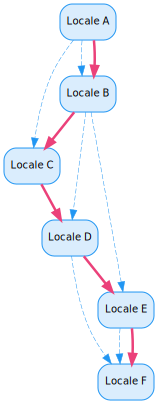

# Locale

A [Locale](xref:UnityEngine.Localization.Locale) represents a language and region. It can also contain additional information, such as currency, calendar, and user-added custom data.

Locales wrap the .Net [CultureInfo](https://docs.microsoft.com/en-us/dotnet/api/system.globalization.cultureinfo) class. However, you can also define a custom Locale that the CultureInfo class does not support.

| **Property**              | **Description** |
| ------------------------- | --------------- |
| **Locale Name**           | The name of the Locale. Set this value to customize how the Locale name should be presented to the user, such as in a language selection menu.
| **Locale Code**           | The culture name in the format `[language]-[region]`. The name is a combination of an [ISO 639](https://www.iso.org/iso-639-language-codes.html) two-letter lowercase culture code associated with a language and an [ISO 3166](https://www.iso.org/iso-3166-country-codes.html) two-letter uppercase subculture code associated with a country or region. For example, Language English would be 'en', Regional English(UK) would be 'en-GB' and Regional English(US) would be 'en-US'. It is possible to use any string value when representing a non-standard identifier.
| **Culture Info**          | This field shows the [Culture Info](https://docs.microsoft.com/en-us/dotnet/api/system.globalization.cultureinfo) match that was found for the Locale Code.
| **Use Custom Formatter**  | When region specific formatting is applied using [Smart Strings](Smart/SmartStrings.md), the [Culture Info](https://docs.microsoft.com/en-us/dotnet/api/system.globalization.cultureinfo) is used. This controls formatting such as time, date, currency and numbers. Enable the Custom Formatter field to be able to change a locale using a different formatter.
| **Custom Formatter Code** | A Custom code in the form `[language]-[region]` that you can use when formatting region specific values.
| **Sort Order**            | Use the sort order to override the order of Locales when sorted in a list. You can use the ordering of this list when displaying the Locales in a language selection menu. If Locales both have the same SortOrder then they will be sorted by their Locale Names. By default, Locales are sorted in ascending order with the lowest Sort Order first.
| **Metadata**              | Use this to attach additional [Metadata](Metadata.md) to a locale which can be used by scripts at runtime.

## Fallbacks

When the Localization system can't find a localized asset or string for a particular Locale, it attempts to fall back to another Locale and use the localized value from that.
For example, a game may have a regional language such as French(Canadian) that only implements a subset of the game’s text, and then falls back to French(France) for the remainder. You can also use this to fall back to completely different Locales, such as when a game may only be partially translated and it is better to show the text in the game's default language rather than not at all.

To configure a Locale fallback, add the [Fallback Locale](xref:UnityEngine.Localization.Metadata.FallbackLocale) metadata to a Locale.

_Example of a French Locale configured to fallback to English_

This example shows how Unity determines what order to evaluate fallbacks when a Locale contains multiple fallbacks:

| **Locale**   | **Fallbacks**      |
| ------------ | ------------------ |
| **Locale A** | Locale B, Locale C |
| **Locale B** | Locale D, Locale E |
| **Locale C** |                    |
| **Locale D** | Locale F           |
| **Locale E** | Locale F           |
| **Locale F** |                    |

The following steps explain the process when Locale A is the selected Locale and the Localization system needs to find a fallback:

1. A list of fallback locales is generated, **Locale B** and **Locale C** are added to it.

    > Fallback List: [**Locale B**, Locale C]

2. **Locale B** is evaluated and does not contain a localized value. The fallbacks for Locale B are added to the Fallbacks list (**Locale D** and **Locale E**). The next item in the list (**Locale C**) is evaluated.

    > Fallback List: [~~Locale B~~, **Locale C**, Locale D, Locale E]

3. **Locale C** is evaluated and does not contain a localized value. **Locale C** does not have any fallbacks so no new items are added to the Fallbacks list. The next item in the list (**Locale D**) is evaluated.

    > Fallback List: [~~Locale B~~, ~~Locale C~~, **Locale D**, Locale E]

    > [!NOTE]
    > When a Locale contains no fallbacks, the Localization system tries to find one using the Culture Info.

4. **Locale D** is evaluated and does not contain a localized value. The fallback **Locale F** is added to the Fallbacks list. The next item in the list (**Locale E**) is evaluated.

    > Fallback List: [~~Locale B~~, ~~Locale C~~, ~~Locale D~~, **Locale E**, Locale F]

5. **Locale E** is evaluated and does not contain a localized value. The fallback **Locale F** is already in the Fallbacks list and so it is ignored. The last item in the list (**Locale F**) is evaluated.

    > Fallback List: [~~Locale B~~, ~~Locale C~~, ~~Locale D~~, ~~Locale E~~, **Locale F**]

The following diagram shows the order in which the fallbacks are evaluated (red solid line) and the fallback relationship between the Locales (blue dashed line):

