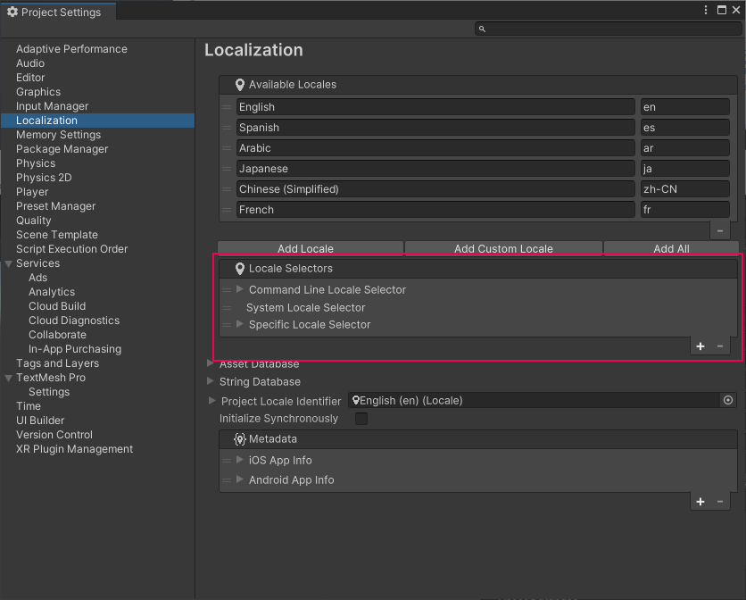
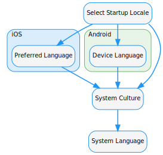

# Startup Locale Selectors

The Locale Selector is part of the [Localization Settings](LocalizationSettings.md). It determines which [Locale](Locale.md) Unity should use when the application first starts or an active Locale isn't selected. For example, you might want to use a default Locale, or attempt to use the Locale that the player is using on their device.

The Localization Settings query each selector in the list, starting at the top(index 0). If a selector doesn't return a locale(null), then it queries the next, until it finds a valid Locale or it reaches the end of the list. This lets you create fallback behaviors when Unity is selecting which Locale to use.

By default, you can choose from the following Locale Selectors.

* [Command Line Locale Selector](#command-line-locale-selector)
* [System Locale Selector](#system-locale-selector)
* [Specific Locale Selector](#specific-locale-selector)
* [Player Pref Locale Selector](#player-pref-locale-selector)

You can create additional custom selectors using the [IStartupLocaleSelector](xref:UnityEngine.Localization.Settings.IStartupLocaleSelector) interface.

## Command Line Locale Selector

The Command Line Locale Selector lets you set the Locale through a command line argument when launching the application. The locale provided through command line should match the Locale Code.
For example `-language=en-GB` would match English(United Kingdom), `-language=ja` would match Japanese.
The default argument is `-language=`. You can configure this in the **Command Line Argument** field.

## System Locale Selector

The System Locale Selector attempts to detect the locale of the device and find a match.
The System Locale Selector queries different APIs until it finds a matching locale or a suitable fallback locale.

- **iOS - Preferred Language**: Unity queries the [iOS Preferred Language](https://developer.apple.com/news/?id=u2cfuj88).
- **Android - Device Language**: Unity queries the [Android getDefault](https://developer.android.com/reference/java/util/Locale#getDefault(java.util.Locale.Category)) value.
- **System Culture**: Unity uses the [CultureInfo.CurrentUICulture](https://docs.microsoft.com/en-us/dotnet/api/system.globalization.cultureinfo.currentuiculture) value.
- **System Language**: Unity uses the [SystemLanguage](https://docs.unity3d.com/ScriptReference/SystemLanguage.html) value as its final check.

## Specific Locale Selector

The Specific Locale Selector selects a specified locale. You can use this to ensure that a Locale is always selected when all other selectors have failed. The selected locale can be configured through the **Locale Id** field.

## Player Pref Locale Selector

The Player Pref Locale Selector uses Unity's [PlayerPrefs](https://docs.unity3d.com/ScriptReference/PlayerPrefs.html) to store and retrieve the selected locale between game sessions. This lets Unity ensure that if the player changes the game language, the next time they start the game it uses the same language they selected previously.