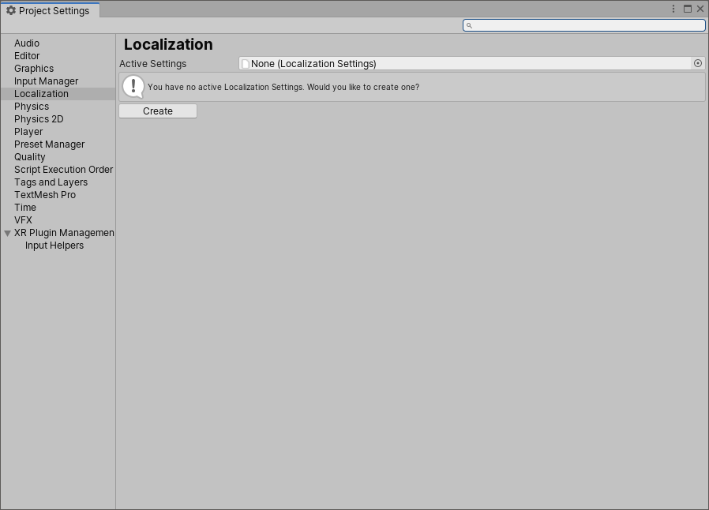
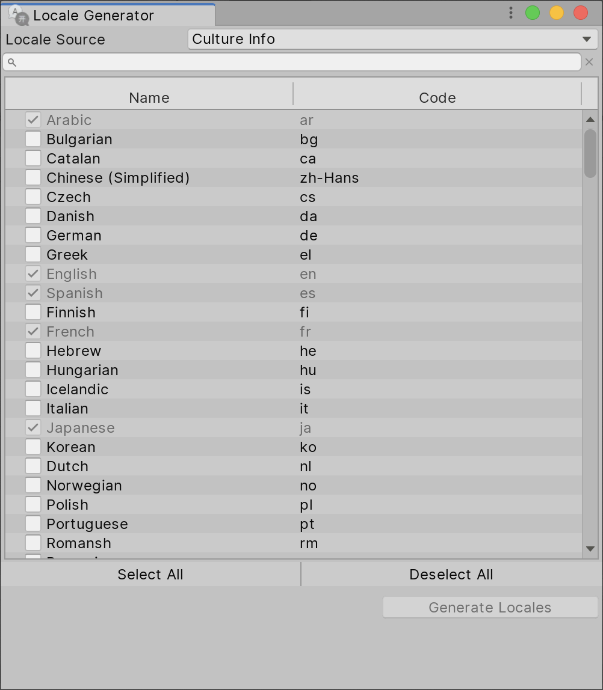
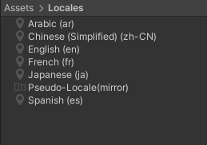
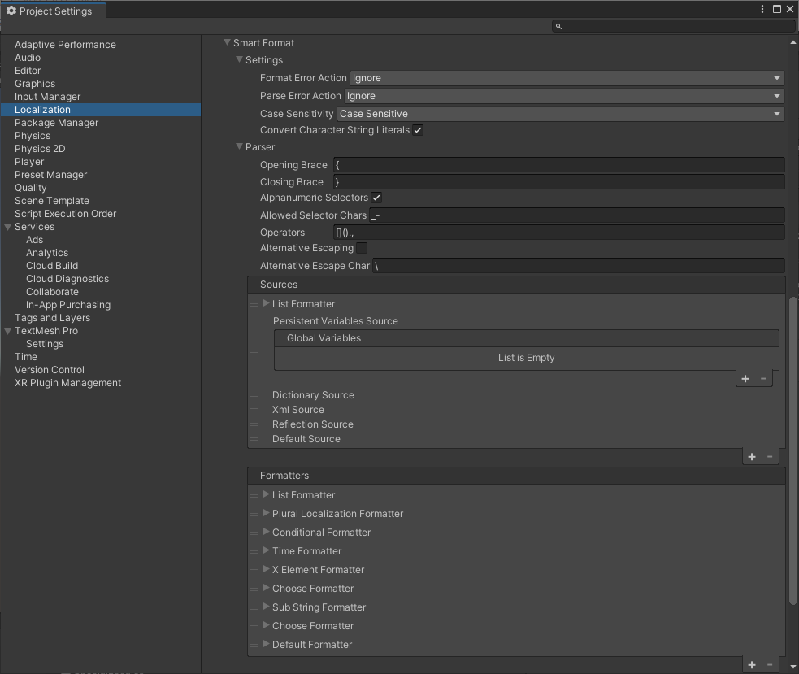

# Localization Settings

The Localization Settings Inspector window is the access point for all things localization-based. It provides an interface to accessing the Project Locales and Asset Tables for the Project.

## Accessing the Settings

To access the Localization Settings navigate to **Edit > Project Settings > Localization.**

If no settings Asset exists, Unity displays a prompt to create one.

You can also create the settings Asset through the Assets menu. Navigate to **Assets > Create > Localization > Localization Settings.**

## Available Locales

**Available Locales** contains the list of [locales](Locale.md) that the Project supports when built.
By default, this uses the Addressable system to fetch Locales. However, you can also create a class that implements *ILocalesProvider* to completely customize this.

### Locale Generator window

To create a Locale, click the **Locale Generator** button in the Available Locales editor.

The Locale Generator provides a set of known Locales that you can select and save to the Project.

Use the **Locale Source** field to control the source that Unity generates the list of Locales from. These known locales can be gathered from either the CultureInfo class or the Unity SystemLanguage enum.

To select a Locale, tick the check box next to its name. Once you have selected the the Locales you want, click the **Create Locales** button. This saves each Locale as an Asset in the Project and marks them as Addressable assets. Locales that are already included in the project will be shown as ticked and disabled.
Locale assets can be removed or added to Addressables by clicking the **Remove Selected** button to remove or **Add** button or the **Add All** button to add all Locale Assets in the project automatically.

## Locale Selector

The [Locale Selector](LocaleSelector.md) determines which Locale Unity should use when the application first starts or an active Locale is not selected. For example, you might want to use a default Locale, or attempt to use the Locale that the player is using on their device.

The Localization Settings will query each selector in the list, starting at the top(index 0). If a selector returns null, then it queries the next, until it finds a valid Locale or it reaches the end of the list. This allows you to create fallback behaviors when Unity is selecting which Locale to use.

## Asset Database

The Asset Database is responsible for retrieving the various Asset Tables and subsequent Assets, this involves querying and loading through the Addressable Assets system.
The **Default Table** field can be used to set a default Asset Table name, this can then be used when loading assets and not providing an explicit table name.

## String Database

The String Database is responsible for retrieving the various String Tables and subsequent localized strings.

The **Default Table** field can be used to set a default String Table name, this can then be used when loading strings and not providing an explicit table name.

The **No Translation Found Format** field can be used to configure the string that should be returned for non-localized values.

## Project Locale

The Project Locale identifies the default locale, such as the locale that the application was developed in. This property is primarily used by the [Localized Property Variants](LocalizedPropertyVariants.md) system.

## Preload Behavior

The Localization system can preload [String Tables](StringTable.md#preloading) or [Asset Tables](AssetTable.md#preloading) so they are available immediately when the Localization system initializes.
The **Preload Behavior** options define which tables are preloaded:

| **Option** | **Description** |
| ---------- | --------------- |
| **No Preloading** | No tables are preloaded. |
| **Preload Selected Locale** | Only the tables from the currently selected Locale are preloaded.
| **Preload Selected Locale And Fallbacks** | Tables from the currently selected Locale and all [fallback](Locale.md#fallbacks) locales are preloaded.
| **PreloadAllLocales** | Preloads all tables from all locales. |

## Initialize Synchronously

When the application starts or the selected Locale changes, the Localization system must initialize itself. Initialization involves loading the supported locales and preloading the string and asset tables. By default this is performed asynchronously and executes in the background while Unity is running. Enabling the **Initialize Synchronously** setting blocks the main thread until initialization is complete. This forces the localization initialization operation to complete immediately. The [WaitForCompletion](xref:UnityEngine.ResourceManagement.AsyncOperations.AsyncOperationHandle.WaitForCompletion) method is used to force the operation to complete, note this is not supported on [WebGL](https://docs.unity3d.com/Packages/com.unity.addressables@latest/index.html?subfolder=/manual/SynchronousAddressables.html#webgl).

## Smart Format Settings

The **Smart Format** section can be used to configure the behavior when parsing and formatting [Smart Strings](Smart/SmartStrings.md)

You can configure Smart String settings in the Localization tab of the Project Settings (Edit > Project Settings).

### Settings

The Settings section contains general settings to configure how to parse and format smart strings

| **Field** | **Description** |
| --------- | --------------- |
| **Format Error Action Parse Error Action** | The error actions determine how Unity reacts when it encounters any errors during parsing(interpreting the string tokens) and formatting(converting parsed tokens into string values).  The following options are available:<ul><li>**ThrowError**: Throws an exception. This is the default value and recommended for debugging, so that formatting errors can be easily found.</li><li>**OutputErrorInResult**: Includes the error message in formatted string.</li><li>**Ignore**: Ignores errors and tries to output the data anyway.</li><li>**MaintainTokens**: Leaves invalid tokens unmodified in the text.</li></ul>To trace any formatting or parsing errors, subscribe to the corresponding events: `Smart.Default.OnFormattingFailure` `Smart.Default.Parser.OnParsingFailure` These events fire for all errors and error action values. This lets you decide in your code how to deal with errors. |
| **Case Sensitivity** | Determines whether placeholders are case-sensitive or not. |
| **Convert Character String Literals** | Literal text is text that is not a placeholder and is not replaced. When enabled literal text is treated as a C# string and [escape sequences](#escape-sequences) are converted, for example **\n** would become a new line and **\t** would be converted into a tab.

#### Escape Sequences

The following [escape sequences](https://docs.microsoft.com/en-us/dotnet/csharp/programming-guide/strings/#string-escape-sequences) are supported when **Convert Character String Literals** is enabled:

| **Escape sequence**     | **Character Name**                                     | **Unicode encoding** |
| ----------------------- | ------------------------------------------------------ | -------------------- |
| **\\`**                 | Single quote                                           | 0x0027 |
| **\\"**                 | Double quote                                           | 0x0022 |
| **\\\\**                | Backslash                                              | 0x0008 |
| **\\0**                 | Form feed                                              | 0x000C |
| **\\a**                 | Alert                                                  | 0x0007 |
| **\\b**                 | Backspace                                              | 0x0008 |
| **\\f**                 | Form feed                                              | 0x000C |
| **\\n**                 | New line                                               | 0x000A |
| **\\r**                 | Carriage return                                        | 0x000D |
| **\\t**                 | Horizontal tab                                         | 0x0009 |
| **\\v**                 | Vertical tab                                           | 0x000B |
| **\\u**                 | Unicode escape sequence (UTF-16)                       | `\uHHHH` (range: 0000 - FFFF; example: `\u00E7` = "ç")
| **\\{**                 | Left curly bracket. Requires **Alternative Escaping**. | 0x007B |
| **\\}**                 | Right curly bracket. Requires **Alternative Escaping** | 0x007D |

### Parser

The parser is responsible for converting a Smart String into a set of format items that can be interpreted by the Sources and Formatters and in some cases further parsed when handling nested format items.

| **Field** | **Description** |
| --------- | --------------- |
| **Opening Brace Closing Brace** | The Opening and Closing braces are used to indicate the start and end of a Format Item. By default the same braces as String.Format are used { }.  For example: `Some text {0}` |
| **Alphanumeric Selectors** | When enabled Unity allows selectors to contain alphabetical selectors in the range a-z and A-Z. For example: `Some text {FormatItem}` |
| **Allowed Selector Chars** | Contains a list of additional characters that a selector can contain to support additional selector syntaxes such as math. |
| **Operators** | Contains a list of characters that come between selectors. This can be "." for dot-notation, [ ] for arrays or even math symbols. |
| **Alternative Escaping** | Smart Strings are a replacement for [string.Format](https://docs.microsoft.com/en-us/dotnet/api/system.string.format). Therefore, curly braces are escaped the string.Format way. So if the desired output is {literal}, double the open and closing curly braces to be {{literal}} instead. This string.Format compatibility, however, causes problems when using SmartFormat's extended formatting capabilities, for example the following would not work: {0:{Persons:{Name}\|, }}.  The reason is the double curly braces at the end of the format string, which the parser will escape, leading to a missing closing brace exception.  This issue is solved by using an alternative escape character instead. When enabled and you wish to treat a double curly brace as literal it should be preceded by a backwards slash (\\). So the following would be treated as literal: "\\{literal\\}". |
| **Alternative Escape Char** | The character to use in conjunction with an opening or closing brace to indicate that it should be treated as a literal character and not a selector bracket. |

### Sources

The sources to consider when evaluating [Selectors](Smart/SmartStrings.md#selector).

Sources are evaluated starting with the first item at the top of the list and working downwards. The order of the sources can result in different strings.

### Formatters

The [formatters](Smart/SmartStrings.md#formatters) available.
