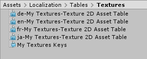

# Localization Tables Window

The Localization Tables Window is used for creating and editing Localization Tables such as [String Tables](StringTables.md) and [Asset Tables](AssetTables.md).

To open the Asset Tables window, navigate to **Window > Asset Management > Localization Tables**. 
Use this window to create and manage the Project's localization Tables. The window consists of two tabs: 

+ **Create Table:** Use this tab to create new Tables.
+ **Edit Table:** Use this tab to make changes to existing Tables within the Project. 

To create a Table, follow these steps:

+ Select the Locales that you want to generate a table for. Unity creates one table per selected Locale.
+ Provide a table name. This is the name you use to refer to the table when querying the Localization Database.
+ Select the Table Type, String Table for localizing strings or text and Asset Table for localizing Unity assets such as Textures, Audio etc.
+ Click Create. This creates an Asset Table Collection, an Asset Table for each Locale.

Once you have created a table, you can edit it in the **Edit Table** tab. Here, you can access all Asset Tables within the project. Use the **Selected Table** dropdown menu to select a table collection to view and edit. Unity displays the table for editing in the lower portion of the Asset Tables window. Different Tables have different editors, depending on the type of information they contain.
Individual table columns can be toggled to show/hide by right clicking the column header.
If the table collection does not have a table for all the Locales in the project then additional columns will be shown to allow for adding a new table to the collection for the missing Locale.

