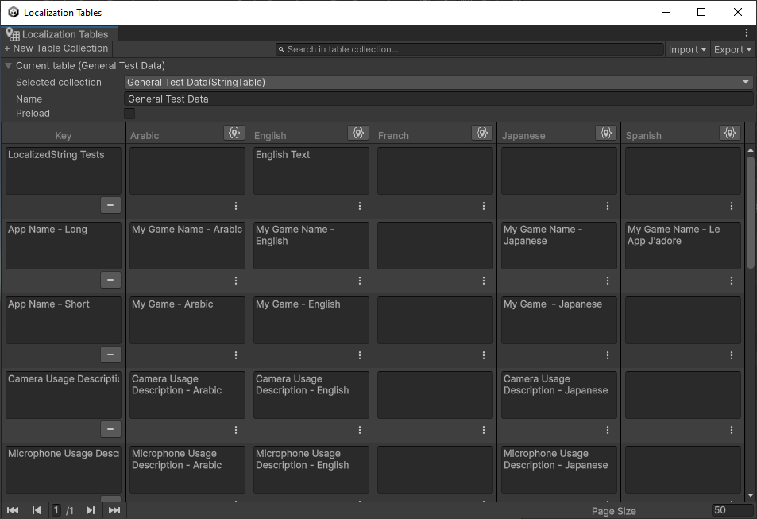
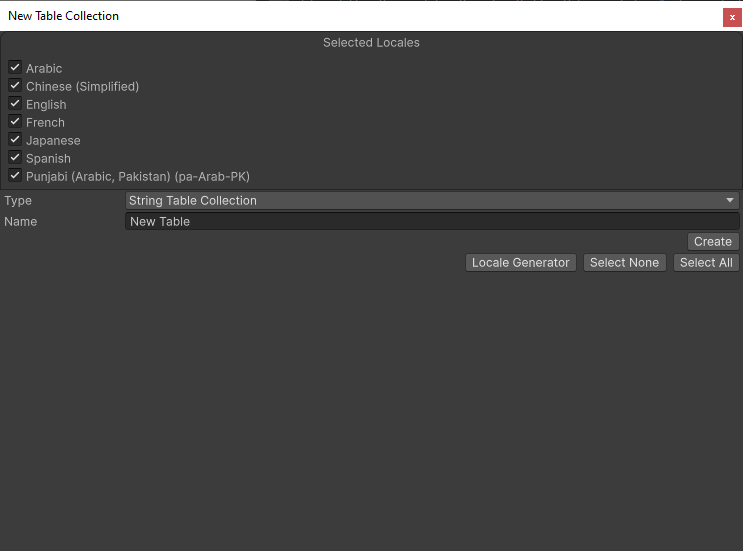

# Localization Tables Window

Use the Localization Tables Window to create and edit Localization Table Collections such as [String Tables Collections](StringTables.md) and [Asset Table Collections](AssetTables.md).

To open the Localization Tables window, navigate to **Window > Asset Management > Localization Tables**. Use this window to create and manage the Project's Localization Table Collections.

**New Table Collection:** Use this to create new Table Collections for Strings or Assets.

To create a new Table Collection, follow these steps:

1. Select the Locales that you want to generate a table for. Unity creates one table per selected Locale. You can add additional Locales after you have created a Table Collection.
1. Provide a Table Collection Name. This is the name you use to refer to the Table when querying the Localization Database.
1. Select the **type** of table you want:

   - To localize strings or text, select **String Table**.
   - To localize Unity assets such as texture or audio, select **Asset Table**.
- Select **Create**.

Once you have created a table, you can edit it in the localization tables window. Here, you can access all Tables within the project. Use the **Selected collection** dropdown menu to select a Table Collection to view and edit. Unity displays the Table for editing in the lower portion of the window. Different Tables have different editors, depending on the type of information they contain. Right-click the header for individual Table columns to toggle their display.

If the table collection does not have a table for all the Locales in the project, then it displays additional columns to allow for the addition of a new table to the collection for the missing Locale.

