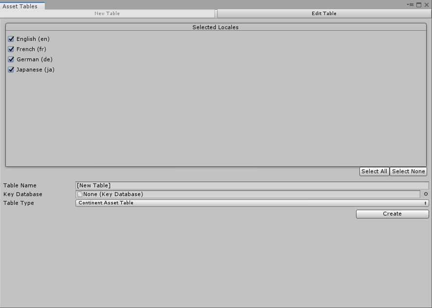

# Localization Tables Window

Use the Localization Tables Window to create and edit Localization Table Collections such as [String Tables Collections](StringTables.md) and [Asset Table Collections](AssetTables.md).

To open the Localization Tables window, navigate to **Window > Asset Management > Localization Tables**. Use this window to create and manage the Project's Localization Table Collections. The window consists of two tabs:

- **New Table Collection:** Use this tab to create new Table Collections for Strings or Assets..
- **Edit Table Collection:** Use this tab to make changes to existing Table Collections within the Project.

To create a new Table Collection, follow these steps:

- Select the Locales that you want to generate a table for. Unity creates one table per selected Locale. You can add additional Locales after you have created a Table Collection.
- Provide a Table Collection Name. This is the name you use to refer to the Table when querying the Localization Database.
- Click **Create** for either a String Table or an Asset Table Collection **String Table** for localizing strings or text, or **Asset Table** for localizing Unity assets such as Textures, Audio etc.

Once you have created a table, you can edit it in the **Edit Table** tab. Here, you can access all Asset Tables within the project. Use the **Selected Table Collection** dropdown menu to select a Table Collection to view and edit. Unity displays the Table for editing in the lower portion of the window. Different Tables have different editors, depending on the type of information they contain. Right-click the header for individual Table columns to toggle their display.

If the table collection does not have a table for all the Locales in the project, then it displays additional columns to allow for the addition of a new table to the collection for the missing Locale.

