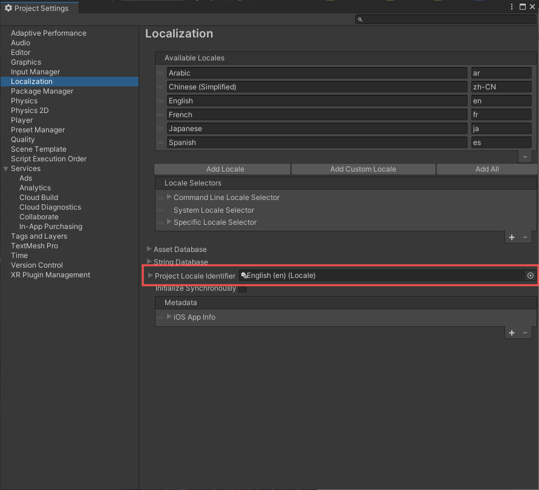
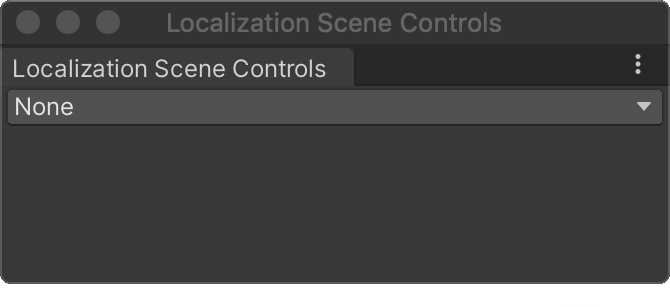
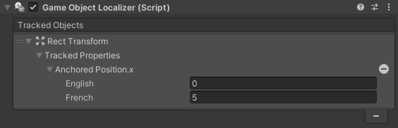
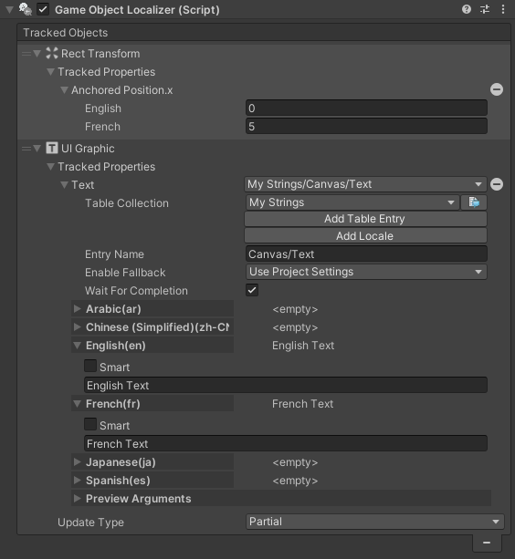
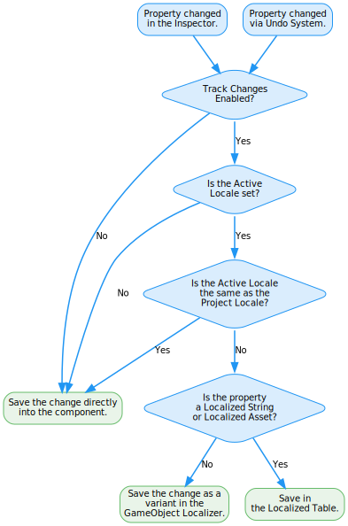
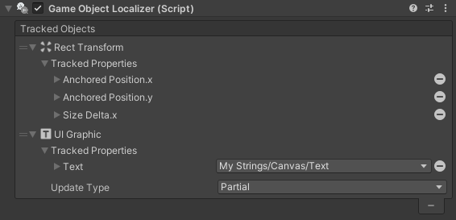
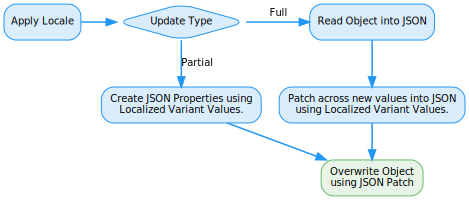

# Localized Property Variants

**Note: This feature requires Unity 2020.3 and above.**

The Localized Property Variants system provides a more natural way to work with multiple Locales in a scene. You can change component properties directly in the Inspector or Scene View. Any changes are recorded as Variants for the currently active Locale.
These Variants are then applied automatically when you switch Locale in the Editor and the Player.
Some typical uses of Localized Properties are:

- Configuring Text to have a different translated value, font and position in a UI for each Locale.
- Making small alterations to components for selected Locales, such as when the text for a particular Locale does not fit.
- Changing audio/textures/sprites for particular Locales.
- Localizing custom scripts without writing any additional code.

The Localized Property Variants system supports the following:

- All [MonoBehaviour](https://docs.unity3d.com/Manual/class-MonoBehaviour.html) or derived classes including Unity [Text](https://docs.unity3d.com/Packages/com.unity.ugui@1.0/manual/script-Text.html) and [TextMeshPro](https://docs.unity3d.com/Manual/com.unity.textmeshpro.html) components.
- [Transform](https://docs.unity3d.com/Manual/class-Transform.html)
- [RectTransform](https://docs.unity3d.com/Packages/com.unity.ugui@1.0/manual/class-RectTransform.html)

Additional components can be supported with custom classes. See [Custom Tracked Objects](#custom-tracked-objects) for further details.

## Configuring Localization Settings

When you change a component, Unity stores the value directly in the component or as a property variant. To define which Locale values to store directly in the component, configure the **Project Locale Identifier field** (Project Settings > Localization). By default this is set to English(en). You can choose any Locale; Unity recommends setting this to the language the game is being developed in. Note: If a property uses a [LocalizedString](xref:UnityEngine.Localization.LocalizedString) or [LocalizedAsset](xref:UnityEngine.Localization.LocalizedAsset`1), then the value is always stored in the relevant String or Asset table and is not stored locally.

## Configuring the Scene Controls

You can configure the Property Variant System using the Localization Scene Controls window (Windows/Asset Management/Localization Scene Controls).

| **Property**      | **Description** |
| ----------------- | --------------- |
| **Active Locale** | The [Locale](Locale.md) that is currently being previewed and edited in the Scene. When you change a component in the scene the change is associated with the Active Locale and is either stored locally in the Component, stored as a variant in the GameObject Localizer component or stored in a String or Asset Table.
| **Track Changes** | Used in conjunction with the Active Locale to determine where a property change should be stored.
| **String Table**  | The [String Table](StringTables.md) collection that is used when new String Property Variants are created. If the value is not set then the values are stored locally instead of inside a String Table. Note: Unity recommends not to store strings locally if you will need to translate them.
| **Asset Table**   | The [Asset Table](AssetTables.md) collection that is used when a new Asset property variant is created. If the value is not set then the asset reference is stored locally instead of inside an Asset Table.

## Changing Values in the Scene

To record a change in the scene as a Localized Property Variant, the **Track Changes** field must be enabled and the **Active Locale** should be set to a Locale other than the Project Locale.
Any change made will now be recorded as a variant and associated with the Active Locale.

When you change a value in the Inspector or through the [Undo](https://docs.unity3d.com/ScriptReference/Undo.html) system, Unity determines whether to record the change as a Property Variant and how to store the variant data.
Unity stores property variant data in one of the following places:

- **Locally** - The value is stored inside the component as it would be normally.

- **Local Variant** - The value is stored in a component called **GameObject Localizer**. You can view and edit the variants in both the GameObject Localizer component and the source component.

_Example of a Local Variant for the position of a GameObject._

- **String Table / Asset Table** - The value is stored in a String or Asset Table Collection. You can view and edit the variant values from the GameObject Localize, the relevant String Table Collection and the source component. Note: When a new value is first created, its Entry Name takes the form `<Scene Name>/<Game Object Hierarchy>`.You can change the name value.

_Example of a String Table Variant._

The following diagram shows how the Property Variant System determines how to record the value when a property is changed.

## GameObject Localizer

The GameObject Localizer component stores and applies all **Localized Property Variants** configurations for the [GameObject](https://docs.unity3d.com/Manual/GameObjects.html) it is attached to. This component is added automatically when a GameObject contains properties that are being tracked.

The Inspector displays the Tracked Components and Localized Properties. You can edit property values directly in the GameObject Localizer Inspector. Properties are tracked using their [serialized property path](https://docs.unity3d.com/ScriptReference/SerializedProperty-propertyPath.html).

### Applying variants

Each Tracked Object applies its property variants when requested to do so by the GameObject Localizer. By default this uses the [JsonSerializerTrackedObject](xref:UnityEngine.Localization.PropertyVariants.TrackedObjects.JsonSerializerTrackedObject) class for Monobehaviour components and custom scripts derived from [TrackedObject](xref:UnityEngine.Localization.PropertyVariants.TrackedObjects.TrackedObject) for Unity components.

JSON Serialization has 2 possible modes called **Update Type**, to apply the values to a Tracked Object:

- **Partial** mode creates an empty JSON file and then patches the properties into it and applies it to the Tracked Object. The JSON only contains the new values.
- **Full** mode first serializes the component into JSON, then patches the new values into the JSON and applies the JSON back to the object. This approach has more of a performance impact but is required when handling any type of **List** or **Array** and fields that cancontain a **serializedVersion** such as [Rect](https://docs.unity3d.com/ScriptReference/Rect.html).

Unity uses the property variants to determine which Update Type to perform automatically; however you can also set this value manually in the Inspector.

## Adding Tracked Objects and Properties through code

The Localized Property Variant System includes both an Editor and Runtime API.
See [GameObjectLocalizer](xref:UnityEngine.Localization.PropertyVariants.GameObjectLocalizer) API documentation for further details.

## Custom Tracked Objects

By default, Unity applies property variant changes through [JSON Serialization](https://docs.unity3d.com/ScriptReference/JsonUtility.html).
Unity components, for example Transform, Camera, Light, do not support JSON serialization at runtime and so require custom code to apply variants. The Localization package contains implementations for **RectTransform** and **Transform**; if you wish to support other Unity components you must implement a custom tracked object.

Custom Tracked objects must inherit from [TrackedObject](xref:UnityEngine.Localization.PropertyVariants.TrackedObjects.TrackedObject) and should include the [CustomTrackedObject](xref:UnityEngine.Localization.PropertyVariants.CustomTrackedObjectAttribute) attribute.

The following example shows how a custom tracked AudioSource can be created to change the Audio Clip Property.

[!code-cs[locale-dropdown](../DocCodeSamples.Tests/GameObjectLocalizerSamples.cs#custom-audio)]

## When to use Component Localizers over Localized Property Variants

Localized property variants provide the most flexible and natural experience when editing a scene and are recommended as the default solution when Localizing. However there are some circumstances when a Component Localizer or custom script will be more suitable such as when dealing with continually changing dynamic elements.

For example, when dealing with dynamic Text that can change multiple times over a short duration, it may be beneficial to use a Script or **Component Localizer** to handle this as applying the changes has a smaller overhead than using the JSON Serialization System that Localized property variants use. However you can still use the Localized Property Variants in conjunction to handle the values that shouldn’t change often for the selected Locale, for example the Font, Font Size, or Transform properties.
A hybrid between dynamic elements using Component Localizers and Static Elements using Localized Property Variants can sometimes help with performance.
