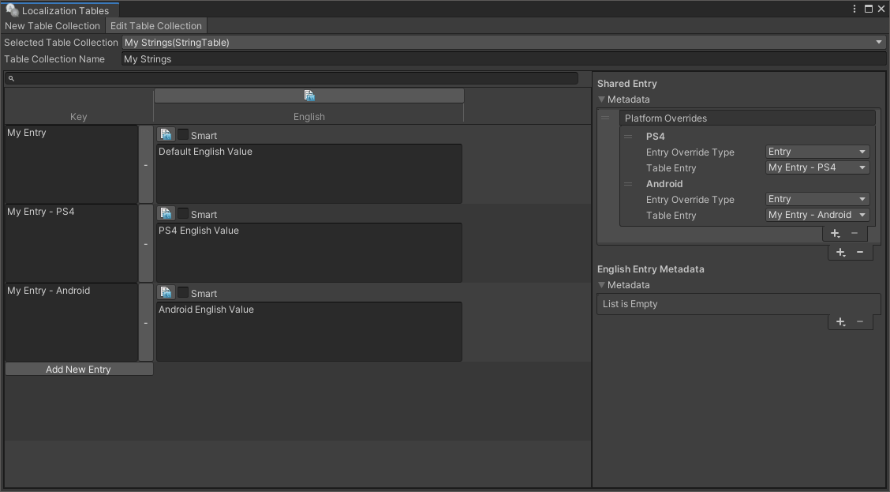
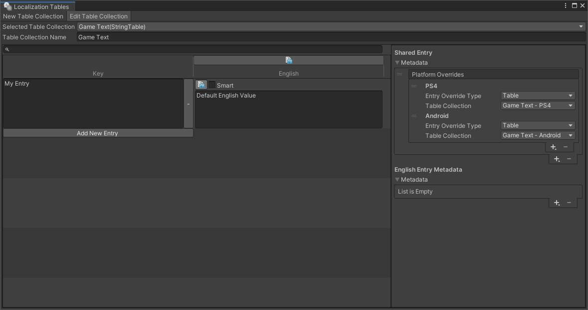
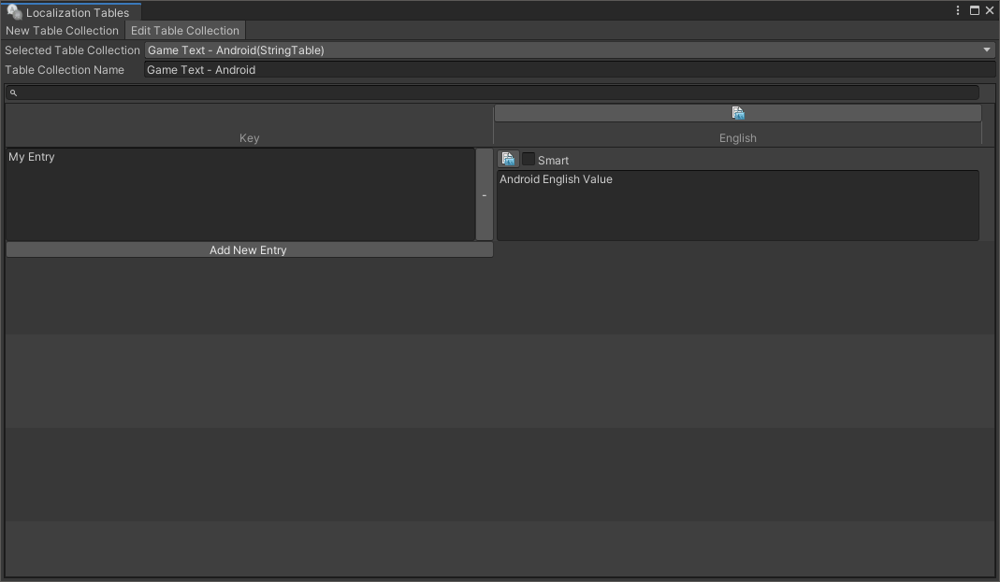
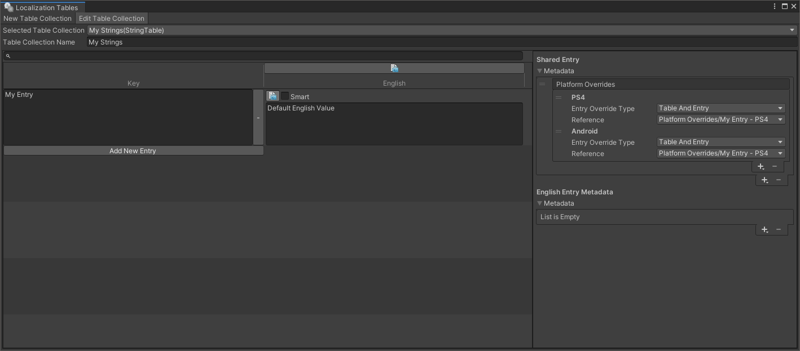
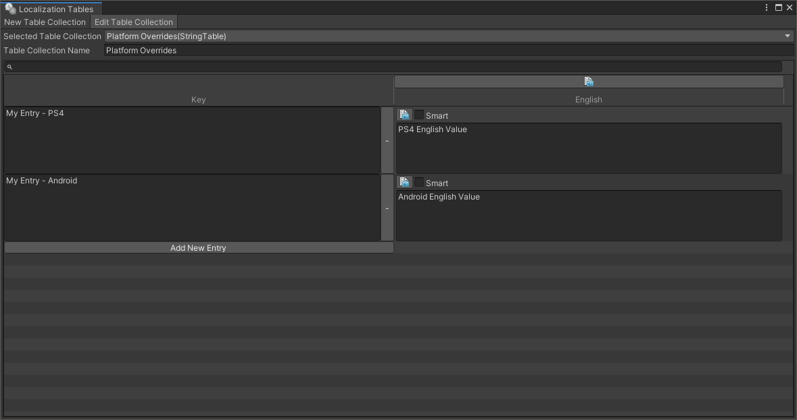
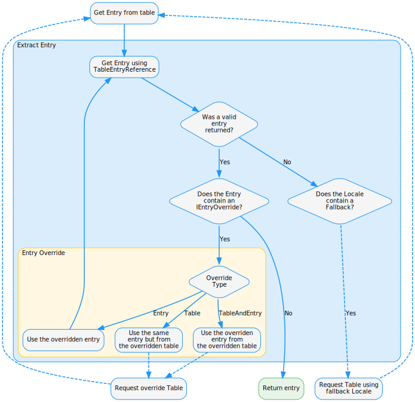
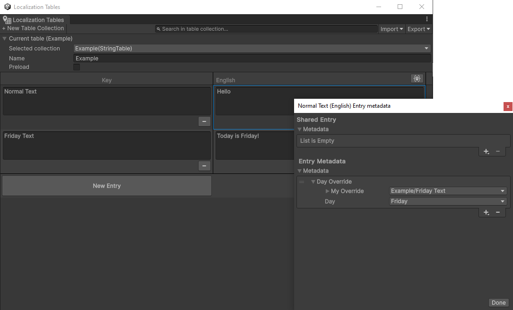

# Platform Overrides

To change where a Localized value for an entry in a [String Table Collection](StringTables.md) or [Asset Table Collection](AssetTables.md) should be taken from, use a Platform Override.

You can add [Platform Overrides Metadata](xref:UnityEngine.Localization.Metadata.PlatformOverride) to an Entry’s Locale specific or Shared [Metadata](Metadata.md).
If a Platform Override exists for the platform that the application is running on, the Override value will be used instead of the default entry value. The Locale override will first be evaluated. If no override is found for the Locale, the Shared Override will be evaluated instead.

Create a new Platform Override by clicking the Add (+) button. This shows the available platforms that do not currently have an override. To remove a Platform Override, select them and click the Remove (-) button.

## Entry Type Override

The Platform Override provides 3 ways to override an entry in a Table Collection.
You can use different Override Types within the same Entry based on requirements.

### Entry mode

To extract a localized value from a separate Entry from the same Table, use Entry Mode .
This means all Localized values can be stored in the same table.

_An example of a String Table Collection using Entry Platform Overrides._

### Table mode

To extract a localized value from a separate table with the same Entry name, use Table mode.
This allows you to have multiple Table Collections that use the same Entry Name but have different values for each platform.
It is safe for the Entries in different tables to have different Key Id's because only the name is considered when using the platform table.

_Example of a String Table Collection using Table Platform Overrides._

_The PS4 Table._

_The Android Table._

### Table And Entry mode

To extract a localized value from a separate table and entry, use Table and Entry mode.

_Example of a String Table using a different Table and Entry for each platform override._

_The Platform Override Table._

## Custom Entry Overrides

It is possible to create custom overrides that can be applied to a table entry or the shared table entry.
For example you may want to change a localized value for a particular region or another criteria such as the date.
The Entry Override is evaluated during the Get Table Entry phase:

To create a custom override implement the [IEntryOverride](xref:UnityEngine.Localization.Metadata.IEntryOverride) interface.
The following example shows how to create an override that will only be applied on a chosen day of the week.

[!code-cs[continent-sample]](../DocCodeSamples.Tests/PlatformOverrideExamples.cs#custom-entry-override)]

_In this example the “Normal Text” entry will be used as the default, when the day is Friday the entry will be overridden and redirected to the Friday Text entry instead._
