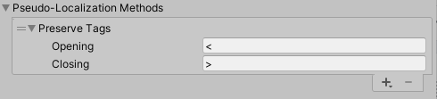
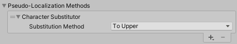
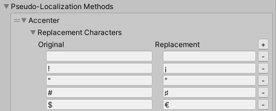
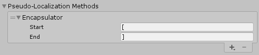
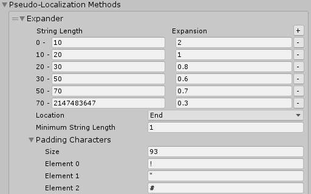
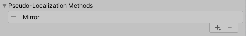

# Methods

A **Pseudo-Localization Method** is the method the Pseudo-Localizer uses to alter the text in your application. All Methods are designed to help you find specific types of localization issues.

The following table demonstrates the output of each Method.

| **Method**                 | **Output** | **Description** |
| -------------------------- | ---------- | --------------- |
| None applied               | `This is an example string. The quick brown fox jumps over the lazy dog.` | Plain text before any Pseudo-Locale Method is applied.
| **Preserve Tags**          | `Ţĥîš îš åñ <color=red>éẋåɱþļé</color> šţŕîñĝ· Ţĥé ǫûîçķ ƀŕöŵñ ƒöẋ ĵûɱþš öṽéŕ ţĥé ļåžý ðöĝ·` | **Preserve Tags** preserves any opening and closing tags in the string, so that any following Pseudo Localization Methods do not modify the tags. By default, this preserves any XML/rich text tags (that is, tags that begin with **<** and and with **>**).
| **Character Substitutor**  | `_________________________`<br>`____________________________`<br>`______________________` | **Character Substitutor** replaces characters in a string with other characters. In this example, letters are replaced with underscores. This is a useful Method to find text that is hard-coded into the UI, and therefore does not go through the localization system.
| **Accenter**               | `Ţĥîš îš åñ éẋåɱþļé šţŕîñĝ· Ţĥé ǫûîçķ ƀŕöŵñ ƒöẋ ĵûɱþš öṽéŕ ţĥé ļåžý ðöĝ·` | **Accenter** replaces all characters with accented versions. This helps to identify characters that are not supported by the font, and to indicate where accented text might not fit in the space.
| **Encapsulator**           | `[This is an example string. The quick brown fox jumps over the lazy dog.]` | **Encapsulator** brackets around each string. This helps to indicate where text is truncated or is concatenated together.
| **Expander**               | `This is an example string. The quick brown fox jumps over the lazy dog.,rAR]/GDcU;"K9X&-l%Nj\` | **Expander** simulates text expansion as the result of localization. This indicates where there is not enough space for languages that have longer strings, and issues where text is likely to clip or truncate.
| **Mirror**                 | `.god yzal eht revo spmuj xof nworb kciuq ehT .gnirts elpmaxe na si sihT` | **Mirror** reverses the string. You can use this alongside design changes to simulate how the UI might look when showing languages that are right-to-left.

You can also combine Methods. The Pseudo-Localization system applies these Methods one at a time, in the order they appear in the Methods list. For example, the default Pseudo-Locale Asset contains the Accenter, Encapsulator and Expander, which results in the following:

[Ţĥîš îš åñ éẋåɱþļé šţŕîñĝ· Ţĥé ǫûîçķ ƀŕöŵñ ƒöẋ ĵûɱþš öṽéŕ ţĥé ļåžý ðöĝ·,ŕÅŔ⁆⁄ĜÐçÛ⁏″Ķ⑨Ẋ⅋‐ļ‰Ñĵ∖]

## Preserve Tags

The **Preserve Tags** method prevents any subsequent methods from modifying text that matches its criteria. The criteria is defined as any tag that starts with the Opening value and close with the Closing value. Pseudo Localization marks any text between the Opening and Closing value as read-only, so that subsequent Pseudo Localization methods do not modify it. This is useful to to prevent Pseudo Localization from modifying XML, Rich Text and other types of tags.



| **Property** | **Description**                                            |
|--------------|------------------------------------------------------------|
| **Opening**  | The opening character that indicates the start of the tag. |
| **Closing**  | The closing character that indicates the end of the tag.   |

## Character Substitutor

The **Character Substitutor** replaces the individual characters in a string.



| **Property**               | **Description** |
| -------------------------- | --------------- |
| **Substitution Method:** | Use the Substitution Method drop-down to determine the method of substitution: To Upper, To Lower, List, or Map.
| **To Upper** | Returns a copy of this string converted to uppercase.
| **To Lower** | Returns a copy of this string converted to lowercase.
| **List** | Returns a copy of this string, but replaces characters in the string with characters defined in the Pseudo-Localization Method’s **Replacement List**. Using a single item for all characters is a good way to flag any text that is hard-coded.
| <ul><li>**List Mode**</li></ul> | There are three options in the **List Mode** dropdown:<ul><li>**Random:** Replaces the original character with a random character form the list.</li><li>**Loop From Previous:** Replaces the first original character with the first character in the list, the second original character with the second character in the list, and so on. This persists across strings. When it reaches the end of the list, it starts again from the beginning of the list.</li><li>**Loop From Start:** Replaces the first original character with the first character in the list, the second original character with the second character in the list, and so on. This does not persist across strings. When it reaches the end of the list, it starts again from the beginning of the list.</li>
| <ul><li>**Replacement List**</li></ul> | The **Replacement List** lists all characters that the Character Substitutor can use to replace original text characters in a string. Use **Size** to define the number of characters available as replacement characters, and use the **Element** text fields to manually enter which characters you want to use.
| <ul><li>**Add Typical Character Set**</li></ul> | To automatically populate the **Replacement List** with characters that commonly appear in a certain language, select a language from the **Add Typical Character Set** drop-down. This is particularly useful when testing fonts for missing character sets.
| **Map** | Returns a copy of this string, but replaces specific characters in the string with specific characters that you define. For example, you could specify that it should replace every lowercase e with an uppercase E.
| <ul><li>**Replacement Characters** | Use the **Replacement Characters** list to specify which characters you want to replace, and what you want to replace them with.<br><br>To add specific replacements, open the **Replacement Characters** foldout and select the plus (+) button in the header of the table. Enter the original character in the **Original** column, and the replacement character in the **Replacement** column.

## Accenter

The **Accenter** replaces all characters with accented versions. This is useful to determine whether accented text characters fit in spaces with a limited height.



| **Property**               | **Description** |
| -------------------------- | --------------- |
| **Replacement Characters** | Use the **Replacement Characters** list to specify which characters you want to replace, and what you want to replace them with. The original character in the **Original** column, and the replacement character in the **Replacement** column. By default, this is configured to replace characters with an accented version of that character.<br><br>You can edit these text fields, or click the minus (-) button next to a row to remove it.

## Encapsulator

The **Encapsulator** adds characters on either side of a string boundary, which helps to visually identify pieces of text that contain multiple strings. By default, it inserts square brackets.



| **Property**               | **Description** |
| -------------------------- | --------------- |
| **Start**                  | Set which character appears immediately before a string of text. This is set to an open square bracket by default.
| **End**                    | Set which character appears immediately after a string of text. This is set to a closed square bracket by default.

Connected strings often create a localization problem, because they fix content in a specific order (for example, in some languages the verb comes before the object of a sentence, while in other languages, the object comes before the verb), or they don’t take into account that some translation might change depending on what is around it.
For example: the string You picked up 1 apple might be constructed from 2 strings in script:

```c#
string PickupItemText(int amount, string itemName)
{
    string localizedText = LocalizeText("You picked up")
    string localizedItem = LocalizeText(itemName);
    return $"{localizedText} {amount} {localizedItem}";
}
```

The pseudo-localized string for this would appear as `[You picked up] 1 [apple]`. This string might not translate to languages which use different sentence structures. A better way to construct the string would be to use a [Smart String](Smart/SmartStrings.md).

## Expander

The **Expander** simulates text expansion as the result of localization. This indicates where there is not enough space for languages that have longer strings, and issues where text is likely to clip or truncate.
In some languages (including English), shorter strings often grow more than longer strings. The Expander allows you to provide different expansion values based on string length to simulate these issues. You can also add multiple rules based on the length of the input string.



| **Property**               | **Description** |
| -------------------------- | --------------- |
| **String Length / Expansion**(table) | Use the table to define how many additional characters to add to a string, based on the string’s length. The **String Length** value defines the number of characters in the string, as a range. The **Expansion** value is a multiplier to determine how many extra characters to add. For example, if **String Length** is 0-10, and the **Expansion** for this range is 2, then the Method multiples any character with a string length of 0-10 by 2 and adds it to the string (so a string of 7 characters will add an additional 14 characters to become 21 characters in total).<br><br>By default, the Expander uses the following values:<ul><li>**0 - 10:** 2</li><li>**10 - 20:** 1</li><li>**20 - 30:** 0.8</li><li>**30 - 50:** 0.6</li><li>**50 - 70:** 0.7</li><li>**70+ :**0.3</li></ul><br>To add a new range to the table, click the plus (+) button next to the table header. The range for the new line automatically starts at the end of the range from the previous line.<br><br>If you’re not sure how much you should expand by, see _Guideline expansion values_, below.
| **Location** | Define where to insert the extra characters: at the **Start** or **End** of the string, or **Both**. if you select **Both**, the Pseudo-Localization system applies half to the start and half to the end of the string, with an additional one on the end for odd-number values. This is set to **End** by default.
| **Minimum String Length** | You can use this value to adjust the minimum string length after pseudo-localization. At runtime, the Pseudo-Localization system calculates the string length based on both this and the **String Length** value, and uses whichever is bigger.
| **Padding Characters** | The **Padding Characters** list lists all characters that the Expander can use to add characters to a string. Use **Size** to define the number of characters available, and use the **Element** text fields to manually enter which characters you want to use. By default, **Size** is set to 93, and the Expander uses all upper and lower case letters, and symbols on a standard American keyboard.

### Guideline expansion values

The following table provides guideline expansion values when translating from English.

| **Language**   | **Expansion from English** |
| -------------- | -------------------------- |
| Arabic         | +20% to +25%               |
| Croatian       | 15%                        |
| Czech          | 10%                        |
| Danish         | -10% to -15%               |
| Finnish        | -25% to -30%               |
| French         | +15% to +20%               |
| German         | +10% to +35%               |
| Greek          | 10%                        |
| Hebrew         | -20% to -30%               |
| Hindi          | +15% to +35%               |
| Italian        | +10% to +25%               |
| Japanese       | -10% to -55%               |
| Korean         | -10% to -15%               |
| Norwegian      | -5% to -10%                |
| Polish         | +20% to +30%               |
| Portuguese     | +15% to +30%               |
| Russian        | 15%                        |
| Spanish        | +15% to +30%               |
| Swedish        | -10%                       |
[(Source: Andiamo)](https://www.andiamo.co.uk/resources/expansion-and-contraction-factors/)

## Mirror

The **Mirror** method reverses the input string to simulate right-to-left languages. This Method has no configuration settings.



## Custom Methods

To create a new Pseudo-Localization Method, implement the [IPseudoLocalizationMethod](xref:UnityEngine.Localization.Pseudo.IPseudoLocalizationMethod) interface. Unity adds custom Methods to the Pseudo-Locale Assets’ list of available Methods.

## Apply a Pseudo-Locale Asset

When you enter Play mode, Unity displays a dropdown in the top-right corner of the Game view, which allows you to select a Pseudo-Locale Asset. When you select a Pseudo-Locale Asset, Unity replaces text with the pseudo-localized values defined by that Pseudo-Locale Asset.

The values Unity replaces the text with is defined by the Pseudo-Locale Asset’s **Source Locale Code**. For example, a Pseudo-Locale that uses **English (en)** as its source loads the English string, and then applies pseudo-localization to that string. You can use multiple Pseudo-Locale Assets in a project, so that you can customize each to use different source locales or highlight specific issues.
