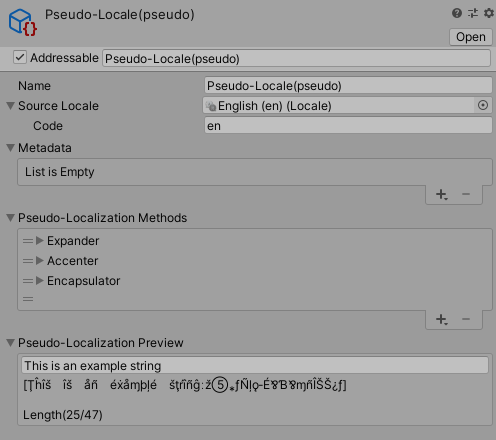

# Pseudo-Localization

Pseudo-localization is a method for testing internationalization aspects of your application during the early stages of development, before you begin translation into different languages. It generates fake translations that take up the same amount of space and use similar character sets, and highlights issues that might occur when you apply real translation to the content of your application.

Pseudo-localization can help flag potential problem areas, such as:

- **Limited space:** Areas where there might not be enough space for translated text, causing it to wrap awkwardly or truncate.
- **Non-localized strings:** Strings that are hard-coded and do not go through the localization framework.
- **Combining separately translated sentences or paragraphs** that are built in a way that is difficult to localize.
- **Font encoding and conversion issues:** Ensure fonts support all the necessary special characters for each language and that the glyphs for such special characters don't have any design issues.
- **Right-to-left text issues:** A user interface in a right-to-left (RTL) language needs to be laid out in a mirror image of a left-to-right layout.
- **Non-localized art**, such as textures that contain text.

## Example

A typical use for pseudo-localization is to find potential issues in the content of a menu. For example, the following image displays a menu with the original English text:

The following image displays the same menu, but with pseudo-localization applied to the text to expand the amount of space the text needs, and replace some characters with others.

The pseudo-localization shows that the final menu item Exit Game is likely to overlap its space if it is translated into a language that requires more space. If a pseudo-translation does not fit, then it is likely that some real translations don’t fit.

The following image displays the same menu, but with the text translated into Spanish.

The final menu item does indeed grow in size as indicated by the pseudo-localization, and requires manual adjustment to fit it into the UI.
A solution in this case might be to change Exit Game to Quit, which is likely to require less space when translated to other languages.

## Further Reading

- [W3: Text size in translation](https://www.w3.org/International/articles/article-text-size)
- [Game Developer: Pseudo-Localization A Must in Video Gaming](https://www.gamedeveloper.com/programming/pseudo-localization-a-must-in-video-gaming)
- [Minimizing Human Error in Localization](https://www.slideshare.net/AdolfoGomezUrda/minimizing-human-error-in-localization-58860416?next_slideshow=1)
- [Pseudolocalization to Catch i18n Errors Early](https://opensource.googleblog.com/2011/06/pseudolocalization-to-catch-i18n-errors.html)

## Pseudo-Locale Assets

A Pseudo-Locale Asset pulls a value from a [String Table](StringTables.md) and applies pseudo-localization to it on demand. To use Pseudo-Localization, you need to do the following:

- Set up your text in String Tables
- Set up a Pseudo-Locale Asset
- Apply it to your Scene at runtime

## Set up a Pseudo-Locale Asset

To create a new Pseudo-Locale Asset, go to **Assets > Create > Localization > Pseudo-Locale.**

| **Property**                    | **Description** |
| ------------------------------- | --------------- |
| **Name**                        | Set the name of this Pseudo-Locale Asset. It’s useful to give it a name that identifies what it does, or which Methods are attached to it.
| **Source Locale**               | The locale you want to use for pseudo-localization. For example, if you choose English, the Pseudo-Localization system loads the strings from the English String Table, and then pseudo-localizes them.
| **Code**                        | This field auto-populates with the language code of the selected **Source Locale**.
| **Metadata**                    | Use the Metadata list to add two type of data: <ul><li>Comment</li><li>Fallback locale</li></ul>
| **Pseudo-Localization Methods** | Use the **Methods** list to define which methods of pseudo-localization this Pseudo-Locale Asset should apply to your application’s text. By default, the Pseudo-Locale includes the **Accenter**, **Expander** and **Encapsulator**.   See [Methods](Pseudo-Localization-Methods.md) for a full description of each Method.
| **Pseudo-Localization Preview** | This displays a preview of the pseudo-localization settings you have configured. You can edit the text field to see a preview of any text string.

## Apply it to your Scene at runtime

To apply a Pseudo-Locale, the Selected Locale should be changed to the new Pseudo-Locale asset. This can be done in the Editor through the **Locale Game View Menu** or through Script by changing the [LocalizationSettings.SelectedLocale](xref:UnityEngine.Localization.Settings.LocalizationSettings.SelectedLocale).
The package **Samples**, which can be found in the Package Manager, contain examples of changing the Locale and example Locale Selection menus.
