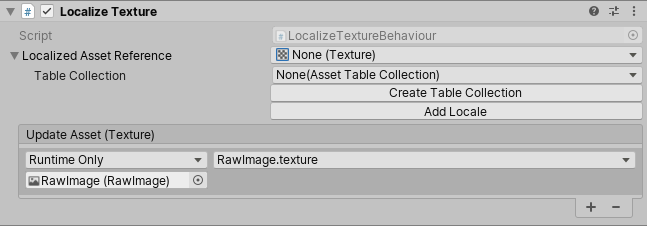
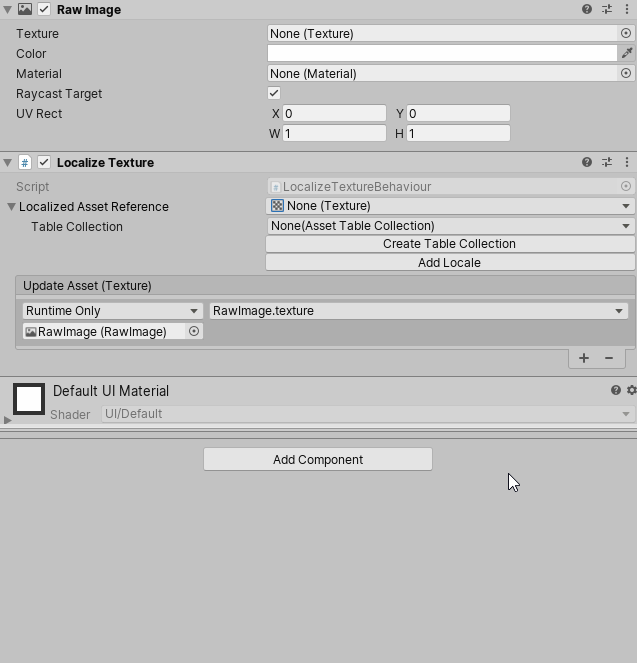
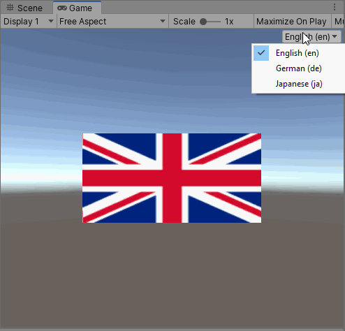

# Quick Start Guide

This guide will take you through setting up a simple Project with localized Assets and strings.

## 1. Create the Localization Settings

The Project's Localization Settings is an Asset. To create this Asset, go to **Edit > Project Settings > Localization** and click **Create**

## 2. Create Locales

Locales represent regions; they determine which language you are localizing your application to, and other localization decisions.

To open the Locale Generator window, navigate to the Localization Settings (menu: **Edit > Project Settings > Localization**) and click the **Locale Generator** button.

To select a Locale, tick the toggle box next to its name. Tick the checkbox next to the Locale you want to add, then click the **Create Locales** button and select where you want to save the Assets to.

## 3. Choose a default Locale

Use the Locale Selectors to determine which Locale your application uses by default if it is not English(en). To do this, add the Locale to the **Specific Locale Selector** field. Your application uses this Locale on start-up, and when no other Locale is selected.

## 4. Texture Localization: Create an Asset Table Collection

There are many reasons you might need to localize an Asset. For example, you might want to play a different piece of voiceover audio or music, or change a texture that contains written text (such as a signpost). The localization system uses Asset Tables to support this.

This demonstrates changing an Asset's Texture to the flag of that Locale's country.

First, you need to create an Asset Table. To do this, open the **Localization Tables Window** (menu: **Window > Asset Management > Localization Tables**).

1. In the Localization Tables window, select **New Table Collection**.
2. Select which locales you want to generate tables for.
3. In the Type dropdown, select **Asset Table Collection**.
4. In the Name field, give the collection a name.
5. Select Create and choose a directory to generate the assets.

Click **Edit Table Collection** and select the **My Assets** table.

A table contains a **Key** field and a value field for each Locale. Unity uses the Key to identify the localized Asset. For this tutorial, name the Key **Country Flag** and use + button to add the key entry.

Select the Texture you want Unity to display for each Locale, and then drag and drop it into the corresponding section of the table, like so:

## 5. Texture Localization: Use the localized Asset

There are multiple ways for Unity to access a localized Asset. This tutorial uses components provided by the localization system, so you do not need to write any scripts.

Add a UI **Raw Image** component to the Scene, you will need the **Unity UI** package installed in the project to use a **Raw Image**.
Add the **Raw Image**, go to **GameObject > UI > Raw Image**. To localize a Raw Image component, right-click the component and then click **Localize**.

This adds a new component called **Localize Texture**. This is a generic localization component. When you add it via the **Localize** option, Unity automatically configures it to localize that component.

Use the **Localized Asset Reference** field to select the **Country Flag** Key you added to the Texture Asset Table previously.

Run the Scene and use the Game View Locale selection dropdown to change the **Locale**. If everything is configured correctly, the country flag changes to the assigned Texture in the Asset Table. If the Game View menu does not appear it can be enabled from the **Localization Project Settings**.

The **Locale Game View Menu** can be used to quickly change the language in the editor. It can be enabled and disabled through **Edit > Preferences > Localization**.

## 6. Audio Localization: Use the localized Asset

To localize Audio Clips, we could follow the same process as localizing the Texture however it is also possible to create and edit the localized assets in the inspector as follows:

1. Add a Audio Source GameObject (menu: GameObject > Audio > Audio Source).
2. Right-click the Audio Source component and click Localize.
3. Expand the **Localized Asset Reference** field.
4. Select the *My Assets* table from the **Table Collection** dropdown.
5. Click **Add Table Entry** and change the name to `National Anthem`.
6. Drag and drop the audio clips into the correct Locale fields.

## 7. String Localization: Create a String Table Collection

First, you need to create a String Table. To do this, open the **Localization TablesWindow** (menu: **Window > Asset Management > Localization Tables**).

1. In the Localization Tables window, select **New Table Collection**.
2. Select which locales you want to generate tables for.
3. In the **Type** dropdown, select **String Table Collection**.
4. In the **Name** field, give the collection a name.
5. Select Create and choose a directory to generate the assets.
6. Select **New Entry** to add an entry to the table.
7. To enable [Smart String](Smart/SmartStrings.md) for the entry, go to its **More** (&#8942;) menu and select *Smart String**.

In this example we will use the Smart String reflection and plural features to print out a variable from the following script:

[!code-cs[apple-sample](../DocCodeSamples.Tests/Apples.cs)]

Enter the following values:

| **Locale** | **Translation** |
| -----------| --------------- |
| English    | {global.player-name} has {apple-component.appleCount:plural:an apple\|{} apples} |
| French     | {global.player-name} a {apple-component.appleCount:plural:une pomme\|{} pommes} |
| Spanish    | {global.player-name} tiene {apple-component.appleCount:plural:una manzana\|{} manzanas} |
| Japanese   | {global.player-name}は{apple-component.appleCount}個のリンゴを持っています |

## 8. String Localization: Use String Table Entries

To add a UI Text element to the Scene, go to **GameObject > UI > Text**.

Right-click the Text component and select the **Localize** option. Unity adds a **Localize String** component and automatically configures it for the GameObject it is attached to. If the Text component contains a string value that is also in a String Table, then Unity automatically assigns this during the setup. If it does not, you can assign a value using the **String Reference** field pop-up.

Press the Add (+) button in the **Local Variables** field, select **Object Reference** and drag the **Apples** Component into the **Object Reference** slot. Name the variable **apple-component**

You've configured the Text and the second Argument, `appleCount`. However, you still need to configure the first argument, {global.player-name}.

1. To create a Variables Group Asset, select **Assets** > **Create** > **Localization** > **Variables Group**.
2. To create a new string variable, select the Add (+) button in the Variables list.
3. Give the variable a name, such as `player-name`.

    

3. To open the Localization Settings, select **Edit** > **Project Settings** > **Localization**.
4. Go to **String Database** > **Smart Format** > Smart Format Sources list**.
1. Select **Add (+)** to create a new Global Variables Source. 
1. Drag and drop the Global Variables Source to the second position in the Sources List, under the List Formatter item.
5. Select **Add (+)** in the Global Variables Source to create a new item. Keep the default name “global”, this is the value used in the first part of the Smart String {**global**.player-name} and drag the Global Variables Source asset into the slot. The Global Variables source is now configured.

    

1. Duplicate the Text GameObject and change the Apple count to a different value. Click **Play** and notice that the text uses the correct plural form for each.

    

## 9. Build Preview and configuration

The Addressables player content must be built in order to use the localized assets in the player.
This can be done through the Addressables window **Window > Asset Management > Addressable Assets > Groups** by clicking **Build > New Build > Default Build Script**.
The Addressables window can also be used to control how the assets will be packaged and hosted(such as local storage or via a remote web server).

