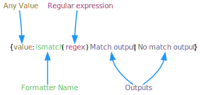

# Is Match Formatter

Use the [Is Match Formatter](xref:UnityEngine.Localization.SmartFormat.Extensions.IsMatchFormatter) to evaluate [regular expressions](https://en.wikipedia.org/wiki/Regular_expression) to control the output.
The Is Match Formatter is not included by default. You can add it to the Formatters in the [Smart Format Settings](../LocalizationSettings.md#formatters).

**Note**: In the options part of the formatter, not all RegEx characters are valid, for example curly braces and parentheses aren’t supported. This is because the same parser is used as for all other extensions.

<table>
<tr>
<th><strong>Example Smart String</strong></th>
<th><strong>Arguments</strong></th>
<th><strong>Result</strong></th>
</tr>

<tr>
<td>{theKey:ismatch(^.+123.+$):Okay - {}\|No match content}</td>
<td>

[!code-cs]

</td>
<td>Okay - Some123Content</td>
</tr>

<tr>
<td>{theKey:ismatch(^.+123.+$):Fixed content if match\|No match content}</td>
<td>

[!code-cs]

</td>
<td>Fixed content if match </td>
</tr>

<tr>
<td>{0:list:{:ismatch(^100\|200\|999$):{:0.00}\|'no match'}\|, \| and }</td>
<td>

[!code-cs]

</td>
<td>100.00, 200.00 and 'no match'</td>
</tr>

<tr>
<td>{0:list:{:ismatch(^100\|200\|999$):'match'\|'no match'}\|, \| and }</td>
<td>

[!code-cs]

</td>
<td>'match', 'match' and 'no match'</td>
</tr>

</table>
