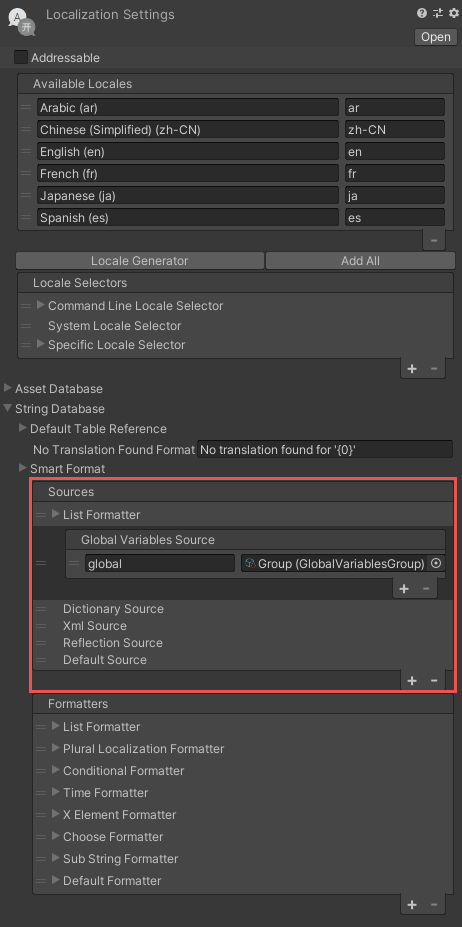
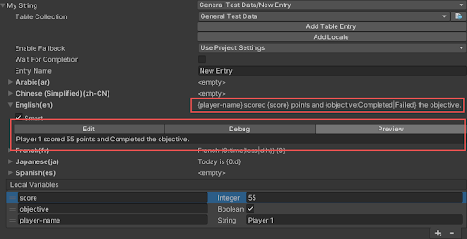
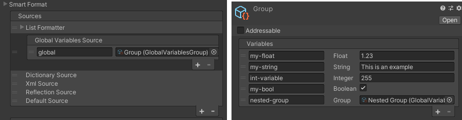
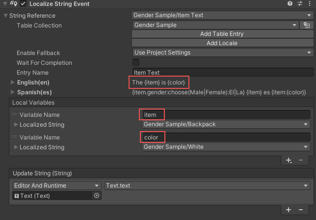
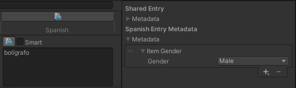
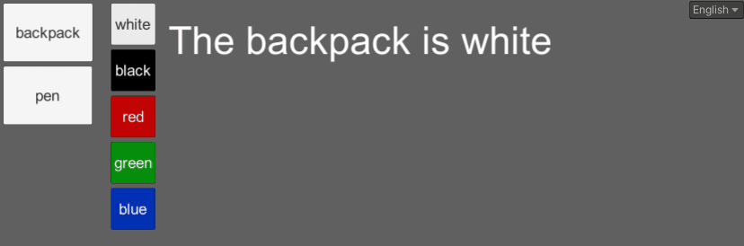
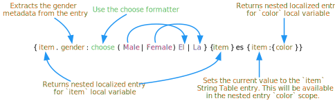
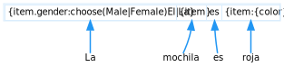

# Persistent Variables source

Providing Arguments to a Smart String often requires writing a script. The [persistent variables](xref:UnityEngine.Localization.SmartFormat.Extensions.PersistentVariablesSource) source works with Global Variables and [LocalizedString](xref:UnityEngine.Localization.LocalizedString) Local Variables to let you specify arguments to a Smart String without a script. In the Editor you can configure arguments for various data types, and create custom arguments.

## Local Variables

Local Variables let you set up arguments to a Localized String that can then be driven by scripts. You can add Local Variables in the Editor or via script. When you change the value of a Local Variable that is in use, the Localized String automatically refreshes.

You can preview Local variables outside of Play Mode, which makes it quicker to author Smart Strings. As such, Local Variables are ideal for testing Smart Strings with various inputs. You can replace the local variable when the Smart String is completed.

The Smart String `{player-name} scored {score} points and {objective:Completed|Failed} the objective`. becomes `Player 1 scored 55 points and Completed the objective`.

## Global Variables

You can configure the Persistent Variables source with multiple global variables to pull data from an external source and convert it into a Smart String without requiring any additional arguments. When the value of a Global Variable changes, you can configure it to automatically update any LocalizedStrings that currently use it.

Access Global Variables by using dot notation inside a placeholder with the following structure:

    {group-name.variable-name}
    {group-name.nested-group-name.variable-name}

### Variables Group asset

A Variables Group asset can contain multiple **Persistent Variables** and/or **Nested Variable Groups**. Create a Variable Group through the Assets menu: **Assets > Create > Localization > Variables Group**. You can assign a Variables Group to the Persistent Variables Source as a Global Variables Group, where it is accessible from any Smart String. It can also be assigned to a Localized Strings **Local Arguments** where it is only accessible from that Localized String instance.

To allow **Smart Strings** to access **Global Variables**, you must add a **Persistent Variables Source** to the **Smart Format Sources** list.

You can add Variable Groups to the list, so long as each group has a unique name with no spaces.

The following example shows a single group with the name global.

| **Example Smart String**                                                 | **Result**                                      |
|--------------------------------------------------------------------------|-------------------------------------------------|
| My Floats value is {global.my-float}                                     | My Floats value is `1.23`                       |
| {global.my-string} of using global variables.                            | `This is an example of` using global variables. |
| The door is {global.my-bool:Open\|Closed}.                               | The door is `Open`                              |
| This is an integer {global.int-variable} as Hex {global.int-variable:X}. | This is an integer `255` as Hex `FF`            |
| Values can be nested {global.nested-group.player-name}                   | Values can be nested `Player 1`                 |

## Triggering updates

Persistent Variables can trigger automatic updates to any [LocalizedStrings](xref:UnityEngine.Localization.LocalizedString) that are currently using it. This means there is no need to track which UI fields need to be updated. If a value changes, the [LocalizedStrings](xref:UnityEngine.Localization.LocalizedString) automatically update to the new value. To configure a Variable to automatically update [LocalizedStrings](xref:UnityEngine.Localization.LocalizedString), have the Variable implement the [IVariableValueChanged](xref:UnityEngine.Localization.SmartFormat.PersistentVariables.IVariableValueChanged) interface. The [LocalizedStrings](xref:UnityEngine.Localization.LocalizedString) checks which Variables it references, and adds itself to the Value Changed events of those Variables. When a value changes, the Value Changed events run and the [LocalizedStrings](xref:UnityEngine.Localization.LocalizedString) automatically refresh to the new value.

[!code-cs]

You can stop the automatic updates of the LocalizedStrings when changing multiple Variables by updating within a PersistentVariablesSource [Update Scope](xref:UnityEngine.Localization.SmartFormat.Extensions.PersistentVariablesSource.ScopedUpdate). Use this to prevent unnecessary updates.

[!code-cs]

## Persistent Variable types

By default you can add the following Persistent Variables:

| **Name**                   | **Description**                                                                                                    |
|----------------------------|--------------------------------------------------------------------------------------------------------------------|
| **Float**                  | Contains a single float value.                                                                                     |
| **String**                 | Contains a single string value.                                                                                    |
| **Integer**                | Contains a single int value.                                                                                       |
| **Bool**                   | Contains a single bool value.                                                                                      |
| **Object Reference**       | Can be used to reference a UnityEngine Object.                                                                     |
| **Nested Variables Group** | Can be used to contain a reference to a Persistent Variables Group Asset. This can allow for nesting of variables. |
| **LocalizedString**        | Can be used to provide nested translations.                                                                        |

## Nested translations

A Localized String can be a persistent variable, allowing for nested translations.
For example the following dynamic string could use localized values for both the item name and the color:
`The {item} is {color}.`

The localized string should be configured in the following way:

The nested localized strings are extracted during the formatting step. If a nested localized string is not currently available, such as when the table is still being loaded, an empty string is returned. When the string loads, a ValueChanged event is triggered, which triggers the root LocalizedString to refresh. If you wish to avoid this, Unity recommends you enable [preloading](../StringTables.md#preloading) on the nested tables if they are different from the root table.

### Handling gender

In some languages gender can change the version of a word that must be used. For example, in Spanish all nouns have a gender, that means they are either masculine or feminine.
The gender of the item affects the structure of the sentence.

When the sentence `The {item} is {color}` is translated to Spanish, it changes based on the gender.

When **masculine** the structure would be: `El {item} es {masculine color}`

When **feminine**, the structure would be
`La {item} es {feminine color}`

For example if the item was a pen(bolígrafo) then the masculine version would need to be used, if the color was red we would also need to use the masculine version which would be rojo.
The full sentence would be: `El bolígrafo es rojo`

One way to handle this is by using the [Choose](Choose-Formatter.md) formatter.

For example: `{gender:choose(Male|Female):El|La} {item} es {color}`. In this example gender could be defined as a local variable in the LocalizedString.

To enable translators to define the gender of the item they are translating, add metadata, for example:

[!code-cs]

Translators could then add the metadata to Spanish entries to define the gender of the entry. You could sync this to a [Google sheet](../Google-Sheets.md) or [CSV](../CSV.md) to let translators set the gender remotely without using Unity.

To enable access to metadata, implement the [IMetadataVariable](xref:UnityEngine.Localization.SmartFormat.PersistentVariables.IMetadataVariable) interface in the metadata script.

The example below shows how the gender metadata could be updated:

[!code-cs]

The VariableName identifies which metadata to use. GetSourceValue then extracts that value during formatting.

A string with {item.gender} can extract the gender metadata from the returned Entry.
Nested localized strings also have access to the current value, this can be used within the nested scope. This means that a translated string for red would look like:

`{gender:choose(Male|Female):rojo|roja}`

The selector **gender** is first checked in the current value, if one is not found it will then check the local variables. This means that you do not need to provide the full path and can use different data types providing they have a selector that matches **gender**.

The final Spanish translation would take the form:

`{item.gender:choose(Male|Female):El|La} {item} es {item:{color}}`

When formatting a nested translation, they have access to both the parent local variables and the local
variables defined in the current [LocalizedStrings](xref:UnityEngine.Localization.LocalizedString). The local variables are first evaluated and then the parent variables if no match was found locally.

The colors would be translated to:

| **Color** | **Spanish**                                  |
|-----------|----------------------------------------------|
| **red**   | {gender:choose(Male\|Female):rojo\|roja}     |
| **green** | verde                                        |
| **blue**  | azul                                         |
| **white** | {gender:choose(Male\|Female):blanco\|blanca} |
| **black** | {gender:choose(Male\|Female):negro\|negra}   |

**Note**: not all colors have a gendered version.

The following diagram shows a breakdown of the Smart String:

This diagram shows how the Spanish translation for "The backpack is red" would be resolved.

The above example can be found in the package samples under the **Persistent Variables** sample.

## Custom Persistent Variables

A custom Variable must be Serializable and implement [IVariable](xref:UnityEngine.Localization.SmartFormat.PersistentVariables.IVariable). The following example demonstrates how to use a Variable to return the current time.

[!code-cs]

This example shows how to create a variable to convert XML text into an XElement variable.

[!code-cs]

To trigger updates to any [LocalizedStrings](xref:UnityEngine.Localization.LocalizedString) that uses the Variable, implement the [IVariableValueChanged](xref:UnityEngine.Localization.SmartFormat.PersistentVariables.IVariableValueChanged) interface.

[!code-cs]

## Custom Variable Groups

Use Custom Variable Groups to return custom Variables. The following example demonstrates this.

[!code-cs]
