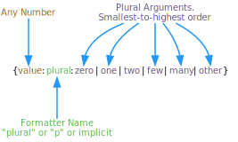

# Plural Localization Formatter

Languages vary in how they handle plurals of nouns or unit expressions, for example, "hour" vs "hours". Some languages have two forms, like English; some languages have only a single form; and some languages have multiple forms. The [Plural Localization Formatter](xref:UnityEngine.Localization.SmartFormat.Extensions.PluralLocalizationFormatter) follows the Unicode [Common Locale Data Repository](https://cldr.unicode.org/) (CLDR) approach to handle plurals.

CLDR uses short, mnemonic tags for these plural categories:

- zero
- one (singular)
- two (dual)
- few (paucal)
- many (also used for fractions if they have a separate class)
- other (required—general plural form—also used if the language only has a single form)

The Plural Localization Formatter supports **cardinal** pluralization rules to choose different text. A full list of the [plural rules](https://cldr.unicode.org/index/cldr-spec/plural-rules) per locale can be found [here](https://www.unicode.org/cldr/cldr-aux/charts/29/supplemental/language_plural_rules.html).

To determine which plural rules to apply, the Plural Localization Formatter uses the locale of the String Table that the smart string is part of. You can override the locale with the Format Option, for example to force English, set (en) as the Format Option:
{0:plural(en):is 1 item|are {} items}

**Note**: The placeholder {} can be used as a shorthand to use the current value.

**Note**: You can use a plural formatter against an IEnumerable value. In this case, the Count of the IEnumerable count is used as the plural value.

| **Example Smart String**                                                          | **Arguments**                                                                          | **Result**                                          |
|-----------------------------------------------------------------------------------|----------------------------------------------------------------------------------------|-----------------------------------------------------|
| I have {0:plural:an apple\|{} apples}                                             | English Locale:  10                                                              | I have 10 apples                                    |
| {0} {0:банан\|банана\|бананов}                                                    | Russian Locale:  1                                                               | 1 баzнан                                            |
| {0:p:{} manzana\|{} manzanas}                                                     | Spanish Locale:  2                                                               | 2 Manzanas                                          |
| The following {0:plural:person is\|people are} impressed: {0:list:{}\|, \|, and}. | [!code-cs] | The following people are impressed: bob, and alice. |
|                                                                                   | [!code-cs] | The following person is impressed: Mohamed.         |
