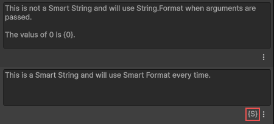
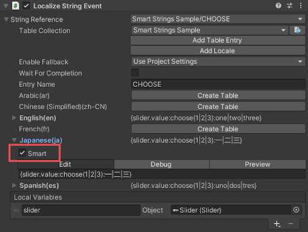
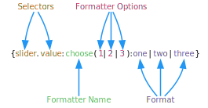
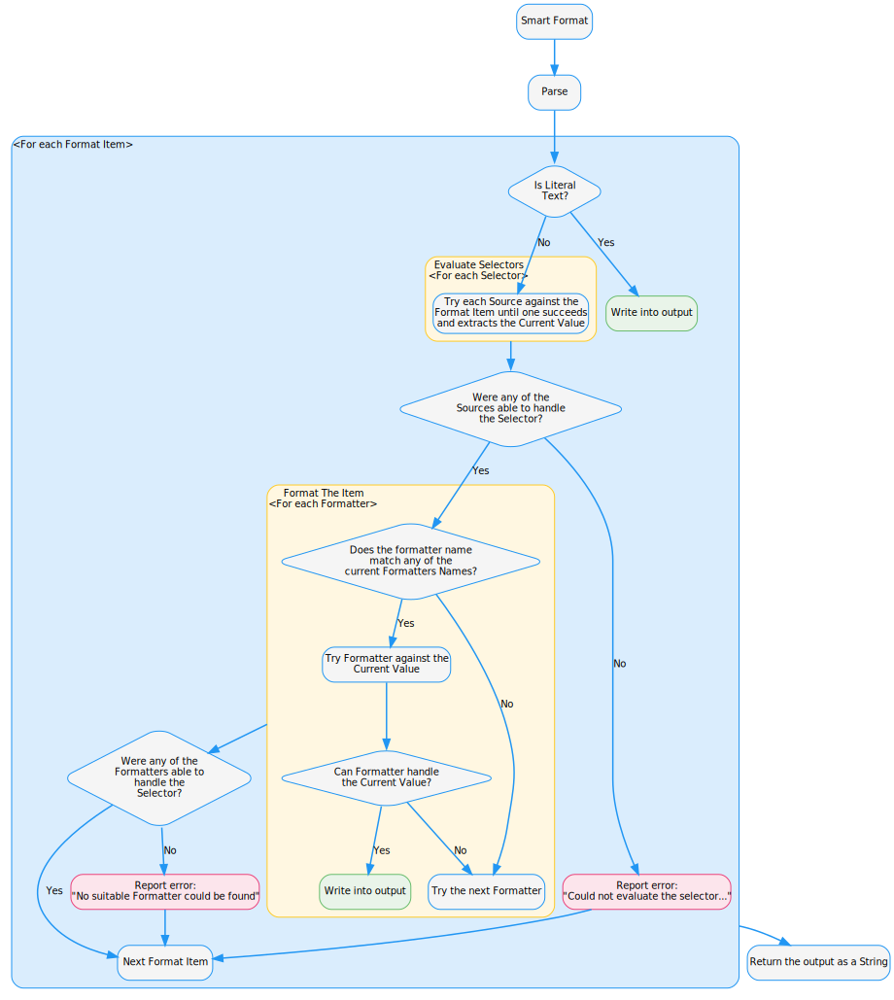
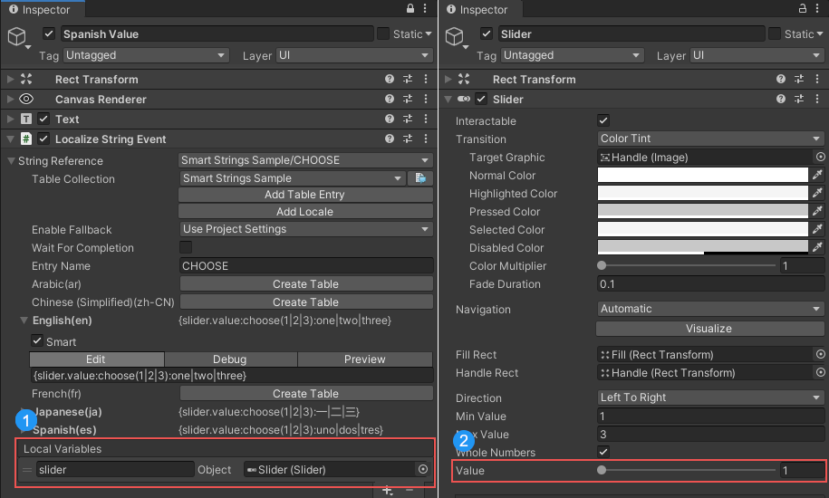
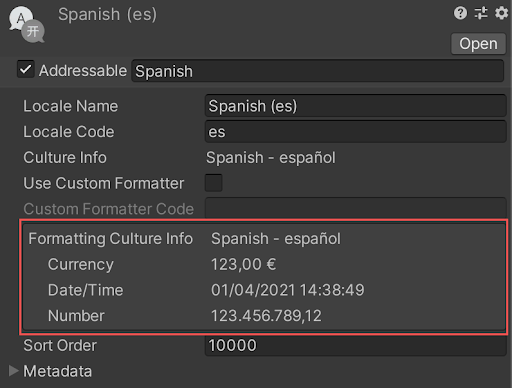

# Smart Strings

Smart Strings are a modified version of the [SmartFormat](https://github.com/axuno/SmartFormat/wiki) library.

Smart Strings are a powerful alternative to using [String.Format](https://docs.microsoft.com/en-us/dotnet/api/system.string.format) when generating dynamic strings; they enable data-driven templates to have proper pluralization, gender conjugation, lists, and conditional language logic. Named placeholders give a more intuitive and less error-prone way to introduce variables which can help to provide additional context to translators.

To mark a localized string as smart, select the Smart field in the Table Editor window.

You can also mark a string as smart in the **Smart** field in the **Localized String** editor.

To mark a field as smart using an Editor script, add the IsSmart property to the field and set it to true.

[!code-cs[mark-smart](../../DocCodeSamples.Tests/SmartStringSamples.cs#mark-smart)]

## Introduction

A Smart String consists of literal text and format items, also known as placeholders. Placeholders are encapsulated inside of a {placeholder} block, similar to [String.Format](https://docs.microsoft.com/en-us/dotnet/api/system.string.format) placeholders.

A placeholder can consist of multiple components, including:

- Selectors
- Formatter name
- Formatter options
- Format

The image below displays the structure of an example Smart String:

The following diagram illustrates the steps taken to format a placeholder. First sources are evaluated until the source data has been selected, then the formatter is applied.

### Selector

Selectors extract the object from the placeholder. This often means extracting a value from an argument or from an external source, for example the [Persistent Variables source](Persistent-Variables-Source.md). The sources evaluate the selectors; then the [formatter](#formatters) formats the object.
For example, if the argument passed is a reference to the script attached to the GameObject, the [Reflection](Reflection-Source.md) source could extract a GameObject’s name with the following smart string:
`The name of the GameObject is {gameObject.name}.`

Multiple sources can be used on a single format item.
For example: `The name of the GameObject is {1:gameObject.name}`
The Smart String would first use the Default Source to extract the argument at index 1, the reflection source would then process the extracted value.

**Note**: When an argument index is not provided, the argument at index 0 is always used.

Sources are evaluated starting with the first item and working through them until a source can handle the selector. The order of the sources can result in different strings.

For example if the following dictionary instance was used as an argument to the Smart String `The value is {Count}`.

[!code-cs[source-order](../../DocCodeSamples.Tests/SmartStringSamples.cs#source-order)]

If the Reflection Source was before the Dictionary Source, then the output would be
`The value is 1`, however if the Dictionary was first, the output would be `The value is Hello World`.

It is important to consider the order of the sources and avoid using named placeholders that might conflict with other sources.

Selector syntax is  similar to C# [interpolated strings](https://docs.microsoft.com/en-us/dotnet/csharp/language-reference/tokens/interpolated); you can use selectors to filter each subset of data to get to the desired object using dot notation.
In the example below, slider and value are both selectors. The slider selector evaluates the argument passed into the Smart String at index 0. The value Selector then evaluates the results of the previous Selector.

**Note**: When no index value is included, the argument at index 0 is used by default.

For example the string could be used with a [UI Slider](https://docs.unity3d.com/Packages/com.unity.ugui@1.0/manual/script-Slider.html) reference to extract the slider’s current value and use that as the source value.

{slider.value}: In this example, the _slider_ Local Variable references a UI Slider. (1). The **Persistent Variables Source** would extract this value.

{slider.**value**}: When the slider has been retrieved, the value placeholder returns the slider’s value (2). The **Reflection Source** would extract this value.

<figure>
  
  <figcaption>Localized String Event Inspector displaying a Smart String configured to use a slider value as its source.The Slider value is driven by a Local Variable named slider</figcaption>
</figure>

#### Multiple arguments

Like with [String.Format](https://docs.microsoft.com/en-us/dotnet/api/system.string.format), you can use multiple data sources as parameters. You can access any value that is not at index 0 using an indexed placeholder.

[!code-cs[multiple-arguments](../../DocCodeSamples.Tests/SmartStringSamples.cs#multiple-arguments)]

For example the `localizedString` could take the following forms to achieve the same resulting string "First dictionary: John, second dictionary: Washington".

|                                                        |                                                               |
|--------------------------------------------------------|---------------------------------------------------------------|
| Dot notation                                           | `First dictionary: {0.Name}, second dictionary: {1.City}`     |
| Nested scope                                           | `First dictionary: {0:{Name}}, second dictionary: {1:{City}}` |
| When no index is specified, Item 0 is used by default. | `First dictionary: {Name}, second dictionary: {1.City}`       |

To define multiple arguments without scripting, see the [Persistent Variables source](Persistent-Variables-Source.md).

#### Nesting and scope

You can nest Smart Strings to avoid repetition, for example: `{User.Address:{Street}, {City}, {State} {Zip}}`

Nesting is often used with conditionals, plurals, and lists.
To illustrate this, the following are equivalent when using an instance of the **Person** class as an argument.

[!code-cs[person-sample](../../DocCodeSamples.Tests/SmartStringSamples.cs#person-sample)]

Without nesting: `{User.Name} ({User.Age}) {User.Address.City} {User.Address.State}`

With Nesting: `{User:{Name} ({Age})} {User.Address:{City} {State}}`

Here, **Name** and **Age** are within the **User** scope and **City** and **State** are within the **User.Address** scope.

Within any nested scope, you can access the outer scopes. For example, in the string  `{User.Address:{User.Name} {City} {State}}`, `{User.Name}`, which is in the root scope, is accessible from within the nested User.Address scope.

To use the current value in scope, use an empty placeholder {}.

### Formatters

Formatters convert the object returned by the selector into a string.
You can use formatters to format date, time, lists, plurals or even apply conditional logic.

To use a specific formatter, specify the formatter name. If you don’t specify a name, the formatter is chosen based on the context of the provided arguments and data.
For example the Plural formatter contains three names: "plural", "p" and "". This means the plural formatter can be explicitly used with the names "plural" or "p"; when no name is specified it is tried implicitly.

|              |                                      |
|--------------|--------------------------------------|
| Explicit use | I have {0:plural:1 Apple\|{} Apples} |
| Explicit use | I have {0:p:1 Apple\|{} Apples}      |
| Implicit use | I have {0:1 Apple\|{} Apples}        |

Implicit formatters are evaluated starting with the first item at the top of the list and working downwards. The order of the formatters can result in different strings.

In most cases using an explicit formatter is preferred because it avoids conflicts with other formatters. However, if the same string is driven by different data, different sources and formatters are used. This requires an implicit formatter.

You can also create [custom formatters](Creating-a-Custom-Formatter.md) by inheriting from the [FormatterBase](xref:UnityEngine.Localization.SmartFormat.Core.Extensions.FormatterBase) class.

Some formatters require additional options to be provided, inside of brackets. For example the options provided in `{0:choose(1,2,3):one|two|three}` would be 1,2,3. The choose formatter would then use them to determine which literal text to use from one, two or three.

#### Localized control formatting

Smart Strings use the Locale for the table they belong to when applying any localized formatting such as currency symbols, number formatting, date and time.

Information on locale formatting is available in the Locale inspector.

