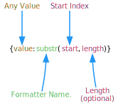
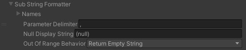

# Sub String Formatter

Use [SubString Formatter](xref:UnityEngine.Localization.SmartFormat.Extensions.SubStringFormatter) to output parts of an input string. If the value is not a string it is first converted to one using the value’s ToString method.

| **Field** | **Description** |
| --------- | --------------- |
| **Parameter Delimiter** | The character used to separate the start and length value. By default it uses a comma. |
| **Null Display String** | The string to display if the string being formatter is null. |
| **Out Of Range Behavior** | Defines what to do if the substring position or length goes out of the range of the provided string.<ul><li>**Return Empty String** - Returns String.Empty.</li><li>**Return Start Index To End Of String** - Returns the remainder of the string starting at start index.</li><li>**Throw Exception** - Throws a FormattingException.</li></ul> |

<table>
<tr>
<th><strong>Example Smart String</strong></th>
<th><strong>Arguments</strong></th>
<th><strong>Result</strong></th>
</tr>

<tr>
<td>{0:substr(5)}</td>
<td><code>"Long John"</code></td>
<td>John</td>
</tr>

<tr>
<td>{0:substr(0, 3)}</td>
<td><code>"New York"</code></td>
<td>New</td>
</tr>

<tr>
<td>Hello {name:substr(1)} {surname}</td>
<td>

[!code-cs]

</td>
<td>Hello L Croft</td>
</tr>

</table>
