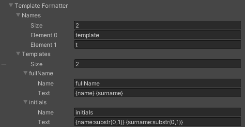

# Template Formatter

The [Template Formatter](xref:UnityEngine.Localization.SmartFormat.Extensions.TemplateFormatter) lets you register reusable templates, and use them by name.
Templates are useful when you want to format text in a particular way across multiple smart strings. When the string needs to be modified, you only need to do it in the template.

| **Example Smart String**                 | **Template**                                           | **Arguments**                                                                            | **Result**                              |
|------------------------------------------|--------------------------------------------------------|------------------------------------------------------------------------------------------|-----------------------------------------|
| The initials are  {0:template(initials)} | initials = `{name:substr(0,1)}} {surname:substr(0,1)}` | [!code-cs] | The initials are L C                    |
| Hello {0.template(fullName)}             | fullName = `{name} {surname}`                          | [!code-cs] | Hello Lara Croft                        |
| The name is {name:t(highlight)}.          | highlight* = `<color=red>{}</color>`                   | [!code-cs] | The name is <color=red>Lara<\/color>.  |
| The name is {surname:t(highlight)}.       | highlight* = `<color=red>{}</color>`                   | [!code-cs] | The name is <color=red>Croft<\/color>. |

\* To use the current value in scope, use an empty placeholder **{}**.
