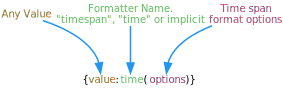

# Time Formatter

Use the [Time Formatter](xref:UnityEngine.Localization.SmartFormat.Extensions.TimeFormatter) to format a [DateTime](https://docs.microsoft.com/en-us/dotnet/api/system.datetime) or [TimeSpan](https://docs.microsoft.com/en-us/dotnet/api/system.timespan) object.

You can combine options using the pipe symbol (|), for example (less|week).)The following options are available:

| **Option** | **Description** |
| ---------- | --------------- |
| **w week weeks** | Shows the range in weeks.  You can combine two range values to form the minimum and maximum for the range.  Example: (RangeMinutes) defines a range of Minutes only; (RangeHours | RangeSeconds) defines a range of Hours to Seconds. |
| **d day days** | Shows the range in days.  You can combine two range values to form the minimum and maximum for the range.  Example: (RangeMinutes) defines a range of Minutes only; (RangeHours | RangeSeconds) defines a range of Hours to Seconds. |
| **h hour hours** | Shows the range in hours.  You can combine two range values to form the minimum and maximum for the range.  Example: (RangeMinutes) defines a range of Minutes only; (RangeHours | RangeSeconds) defines a range of Hours to Seconds. |
| **m minute minutes** | Shows the range in minutes.  You can combine two range values to form the minimum and maximum for the range.  Example: (RangeMinutes) defines a range of Minutes only; (RangeHours | RangeSeconds) defines a range of Hours to Seconds. |
| **s second seconds** | Shows the range in seconds.  You can combine two range values to form the minimum and maximum for the range.  Example: (RangeMinutes) defines a range of Minutes only; (RangeHours | RangeSeconds) defines a range of Hours to Seconds. |
| **ms millisecond milliseconds** | Shows the range in milliseconds.  You can combine two range values to form the minimum and maximum for the range.  Example: (RangeMinutes) defines a range of Minutes only; (RangeHours | RangeSeconds) defines a range of Hours to Seconds. |
| **short** | Displays the highest non-zero value within the range.  Example: "00.23:00:59.000" = "23 hours" |
| **auto** | Displays all non-zero values within the range.  Example: "00.23:00:59.000" = "23 hours 59 minutes" |
| **fill** | Displays the highest non-zero value and all lesser values within the range.  Example: "00.23:00:59.000" = "23 hours 0 minutes 59 seconds 0 milliseconds" |
| **full** | Displays all values within the range.  Example: "00.23:00:59.000" = "0 days 23 hours 0 minutes 59 seconds 0 milliseconds" |
| **abbr** | Abbreviates units.  Example: "1d 2h 3m 4s 5ms" |
| **noabbr** | Does not abbreviate units.  Example: "1 day 2 hours 3 minutes 4 seconds 5 milliseconds" |
| **less** | Displays "less than 1 (unit)" when the TimeSpan is smaller than the minimum range. |
| **noless** | Displays "0 (units)" when the TimeSpan is smaller than the minimum range. |

> [!NOTE]
> When no options are provided, the default options that are used are: (**noabbr|less|auto|seconds|days**)

> [!NOTE]
> The time values are not localized and are only available in English.

<table>
<tr>
<th><strong>Example Smart String</strong></th>
<th><strong>Arguments</strong></th>
<th><strong>Result</strong></th>
</tr>

<tr>
<td>{0:time(abbr)}</td>
<td>

[!code-cs]

</td>
<td>451d 6h 22m 5s</td>
</tr>

<tr>
<td>{0:time(full)}</td>
<td>

[!code-cs]

</td>
<td>451 days 6 hours 22 minutes 5 seconds</td>
</tr>

<tr>
<td>{0:time(less\|weeks)}</td>
<td>

[!code-cs]

</td>
<td>Less than 1 week</td>
</tr>

<tr>
<td>{0:time(less\|d\|h)}</td>
<td>

[!code-cs]

</td>
<td>1 day 6 hours</td>
</tr>

</table>
