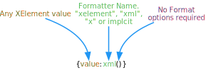

# X Element Formatter

Use the [X Element Formatter](xref:UnityEngine.Localization.SmartFormat.Extensions.XElementFormatter) to write the contents of [XElement](https://docs.microsoft.com/en-us/dotnet/api/system.xml.linq.xelement) values into the format string.

| **Example Smart String** | **Arguments**                                                     | **Result**                |
|--------------------------|-------------------------------------------------------------------|---------------------------|
| {0:xml()}                | `<xml><value>some value</value><tag>some other value</tag></xml>` | Somevaluesome other value |
| {0.value}                |                                                                   | Some value                |
