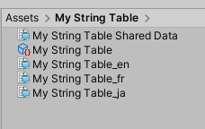
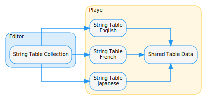
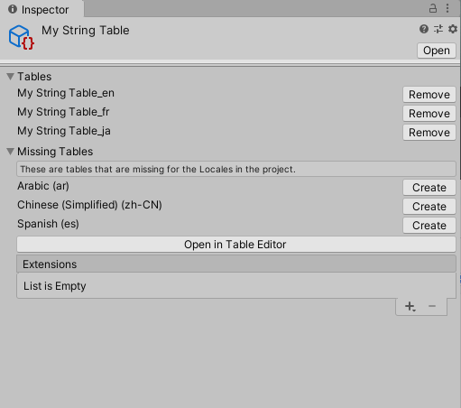
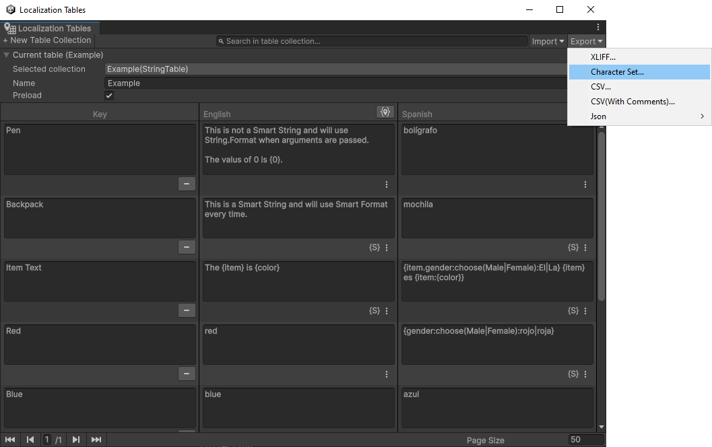
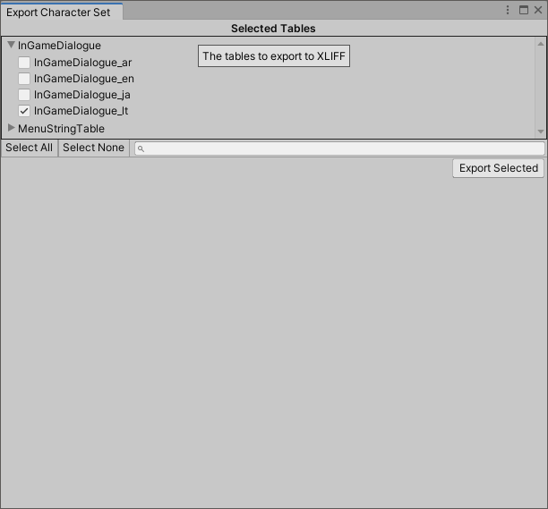

# String Tables

A String Table returns a localized string when requested via a **Key** (an identifying name or unique id) for a specific Locale. String Tables work in a similar way to Asset Tables, but they contain all of the translated string data within them, and they do not require an additional loading step.
Each row on a String Table contains a **Key Id** and a string entry for a specified Locale. A string entry can be either a static string or a tokenized string for use with [Smart Strings](Smart/SmartStrings.md) or [String.Format](https://docs.microsoft.com/dotnet/api/system.string.format).

## String Table Collection

A String Table Collection is an **Editor only** asset. It provides an interface to one or more String Tables that all share the same Shared Table Data and Table Collection Name.

When you create a new String Table Collection, Unity creates a String Table Collection asset and a String Table asset for each Locale, and a single Shared Table Data asset that the String Tables reference. The Shared Table Data asset stores all key names and associated Id values, as well as Shared [Metadata](Metadata.md) (Metadata that all String Tables can access).

You can use the String Table Collection Editor to configure the Editor and player settings, and to add and remove tables from the collection. Removing a table from a collection removes the table from the Localization system, but leaves its data intact so that you can add it back in the future. This allows for chosen String Tables to be enabled and disabled.

Extensions are Editor only data that you can attach to a String Table. An extension can contain additional data that you wish to associate with the String Tables, or it can add functionality such as an importer or exporter for a particular file format or service.

To create custom Extensions, you can inherit from *CollectionExtension* and add the *AssetTableCollectionExtension attribute*.

## Preloading

By default, the Localization system does not pre-load a String Table. This means that the first time Unity requests a String Table or its contents, the Localization table must first load the table., This happens asynchronously in the background, however, it means that the requested string might not be immediately available.
You can configure the Localization system to pre-load String Tables, so that they are immediately available upon request. To do this, navigate to the Asset Tables window, click the Table Properties button (above the Locale name), and enable **Preload All Tables** to preload all tables in this collection or **Preload Table** to only preload the selected table.

## Smart Strings

You can use the **Smart** field to enable or disable [Smart Formatting](Smart/SmartStrings.md) for the table entry. Smart Formatting uses a modified version of the [SmartFormat](https://github.com/axuno/SmartFormat) library. SmartFormat is a lightweight templating library, with an emphasis on grammar. It makes it easy for a data-driven template to have proper pluralization, gender conjugation, lists, and conditional language logic. Named placeholders give a more intuitive and less error-prone way to introduce variables.

## Metadata

You can view [Metadata](Metadata.md) for tables and table entries.

- To view Metadata for a table, select the button above the table column header.
- To view Metadata for a table entry, select the button in the table entry cell.

The Localization system stores **Shared** Metadata in the **Shared Table Data** for the table collection. This means that all Tables have access to this data. Locale-specific Metadata (the list below Shared) is stored in the table and is only accessible by the table with the data.

## Character Sets

Sometimes we need to populate a Font Atlas with specific characters for a language. One practical reason is creating a font from a subset of characters. This is particularly useful for languages with massive character sets (over 50,000 for Chinese). Most games use about 1,000 characters at most, and games with full Chinese and Japanese language support are some of the few that approach this range.
Unity can determine the **Character Sets** for **String Tables** by examining the contents of each table and determining the distinct characters that are in use. The contents of [Smart Strings](Smart/SmartStrings.md) can also be examined so that the literal values are also included into the **Character Set** whilst ignoring any placeholders.

For example, the **Character Set** for the [Smart String](Smart/SmartStrings.md) `You have {count:plural:an Apple|{} apples}!` would be ` !AYaehlnopsuv`.

You can export a **Character Set** file from the context menu of the String Table window, the String Table Collection window, or the Localization Tables window. A **Character Set** can also be generated through script by calling [GenerateCharacterSet](xref:UnityEditor.Localization.StringTableCollection.GenerateCharacterSet).

The type of export depends on where you run the export from:

- **String Table window:** This exports values for the selected String Table only.
- **String Table Collection window:** This exports all values for the selected String Table Collection.
- **Localization window:** This exports all values for the selected String Table Collection.

The **Export Character Set Window** can be used to select multiple **String Tables** to generate the **Character Set** from.

The exported file can then be used to generate a Font Atlas, such as with the TextMeshPro Font Asset Creator.

