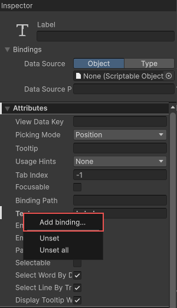
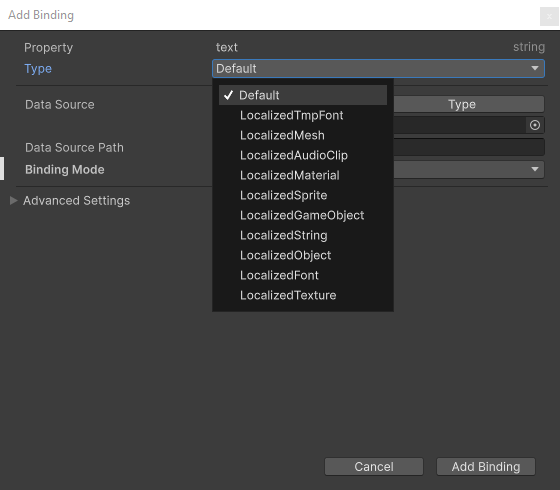
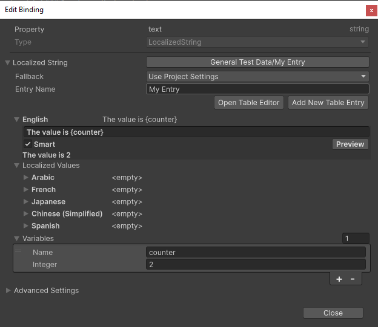

# UI Toolkit (Unity 6+)

> [!NOTE]
> This feature requires Unity 6 and above.

The localization package provides UI Toolkit support through the [data bindings system](https://docs.unity3d.com/2023.3/Documentation/Manual/UIE-data-binding.html).
When you bind a field, it automatically updates itself when you create the UI Document, change the selected locale, or change a persistent variable with a [LocalizedString](xref:UnityEngine.Localization.LocalizedString).
You can add a localized binding in UI Builder, UXML, or C# script.

The following table lists the supported localization bindings:

| **Binding Type** | **Asset Type** |
| - | - |
| [LocalizedString](xref:UnityEngine.Localization.LocalizedString)       | [string](https://learn.microsoft.com/en-us/dotnet/api/system.string)
| [LocalizedAudioClip](xref:UnityEngine.Localization.LocalizedAudioClip) | [Audio Clip](https://docs.unity3d.com/ScriptReference/AudioClip.html) |
| [LocalizedFont](xref:UnityEngine.Localization.LocalizedFont)           | [Font](https://docs.unity3d.com/ScriptReference/Font.html)            |
| [LocalizedGameObject](xref:UnityEngine.Localization.LocalizedMaterial) | [GameObject](https://docs.unity3d.com/ScriptReference/GameObject.html) / [Prefab](https://docs.unity3d.com/Manual/Prefabs.html) |
| [LocalizedMaterial](xref:UnityEngine.Localization.LocalizedMaterial)   | [Material](https://docs.unity3d.com/ScriptReference/Material.html)
| [LocalizedMesh](xref:UnityEngine.Localization.LocalizedMaterial)       | [Mesh](https://docs.unity3d.com/ScriptReference/Mesh.html)
| [LocalizedObject](xref:UnityEngine.Localization.LocalizedObject)       | [Object](https://docs.unity3d.com/ScriptReference/Object.html)
| [LocalizedTexture](xref:UnityEngine.Localization.LocalizedTexture)     | [Texture](https://docs.unity3d.com/ScriptReference/Texture.html)
| [LocalizedTmpFont](xref:UnityEngine.Localization.LocalizedTmpFont)     | [TextMeshPro Font](https://docs.unity3d.com/Packages/com.unity.textmeshpro@3.2/manual/FontAssets.html)
| [LocalizedSprite](xref:UnityEngine.Localization.LocalizedSprite)       | [Sprite](https://docs.unity3d.com/ScriptReference/Sprite.html)

## UI Builder authoring

You can use the [UI Builder](https://docs.unity3d.com/Manual/UIBuilder.html) to create and fine-tune UI assets and their associated data bindings, including localization data bindings. You can connect to visual element attribute fields or styles. You can also address mismatched data types smoothly by creating your own [converters](https://docs.unity3d.com/2023.3/Documentation/Manual/UIE-runtime-binding-data-type-conversion.html) for data type conversion.

To bind an element's field to a localized value in UI Builder, do the following: 

1. In the Inspector panel of an element, right-click on a field and select **Add binding**.

    

1. In the **Add binding** window, select the type of binding you want to use.

    

1. To set up the binding, specify the table and entry you want to reference. If you're using a **LocalizedString** binding and want to include local variables, you can do so through the **Variables** field.

    

    > [!NOTE]
    > By default, the table and entry are referenced using the Guid and ID. To customize this behavior, go to **Edit** > **Preferences** > **Localization** and adjust the **Table Reference Method** and **Entry Reference Method** options.

1. The UI builder-generated UXML includes the new localized string binding like this:

    ```xml
    <ui:UXML xmlns:ui="UnityEngine.UIElements">
        <ui:Label text="Label">
            <Bindings>
                <UnityEngine.Localization.LocalizedString property="text" table="General Test Data" entry="My Entry">
                    <variables>
                        <UnityEngine.Localization.LocalVariable name="counter">
                            <UnityEngine.Localization.SmartFormat.PersistentVariables.IntVariable value="2" />
                        </UnityEngine.Localization.LocalVariable>
                    </variables>
                </UnityEngine.Localization.LocalizedString>
            </Bindings>
        </ui:Label>
    </ui:UXML>
    ```

## UXML authoring

You can also use the following UXML structure to create a binding directly in UXML:

```xml
<ELEMENT>
    <Bindings>
        <BINDING-TYPE property="PROPERTY-PATH" table="TABLE-NAME-OR-GUID" entry="ENTRY-NAME-OR-ID" />
    </Bindings>
</ELEMENT>
```

The following example binds to a labels `text`, `tooltip` and `style.backgroundImage` fields:

```xml
<ui:UXML xmlns:ui="UnityEngine.UIElements">
    <ui:Label text="Label">
        <Bindings>
            <UnityEngine.Localization.LocalizedString property="text" table="GUID:27153e20147c06c4c8d1304d28104a87" entry="Id(328014486446080)" />
            <UnityEngine.Localization.LocalizedString property="tooltip" table="My Table" entry="My Tooltip" />
            <UnityEngine.Localization.LocalizedTexture property="style.backgroundImage" table="My Asset Table" entry="My Texture" />
        </Bindings>
    </ui:Label>
</ui:UXML>
```

In UXML, you can reference a table by either Guid or name. To reference by Guid, prefix the attribute value with `"GUID:"` like this: `table="GUID:27153e20147c06c4c8d1304d28104a87"`.
Similarly, you can reference a table entry by either ID or name. To reference by ID, use this format for the attribute value: `Id(1234)`, where the value within the parentheses represents the ID value.

You can add local variables to a LocalizedString under the `variables` element.

The following example shows an integer and bool local variables:

```xml
<ui:UXML xmlns:ui="UnityEngine.UIElements">
    <ui:Label text="Label">
        <Bindings>
            <UnityEngine.Localization.LocalizedString property="text" table="GUID:27153e20147c06c4c8d1304d28104a87" entry="Id(328014486446080)">
                <variables>
                    <UnityEngine.Localization.LocalVariable name="apple-count">
                        <UnityEngine.Localization.SmartFormat.PersistentVariables.IntVariable />
                    </UnityEngine.Localization.LocalVariable>
                    <UnityEngine.Localization.LocalVariable name="flag">
                        <UnityEngine.Localization.SmartFormat.PersistentVariables.BoolVariable value="true" />
                    </UnityEngine.Localization.LocalVariable>
                </variables>
            </UnityEngine.Localization.LocalizedString>
        </Bindings>
    </ui:Label>
</ui:UXML>
```

To simplify the UXML, define namespace prefixes like this:

```xml
<ui:UXML xmlns:ui="UnityEngine.UIElements" xmlns:l="UnityEngine.Localization" xmlns:lv="UnityEngine.Localization.SmartFormat.PersistentVariables">
    <ui:Label text="Label">
        <Bindings>
            <l:LocalizedString property="text" table="My Table" entry="My Entry">
                <variables>
                    <l:LocalVariable name="apple-count">
                        <lv:IntVariable />
                    </l:LocalVariable>
                    <l:LocalVariable name="flag">
                        <lv:BoolVariable value="true" />
                    </l:LocalVariable>
                </variables>
            </l:LocalizedString>
        </Bindings>
    </ui:Label>
</ui:UXML>
```

## Scripting

You can manipulate bindings on an element through the [Scripting API](https://docs.unity3d.com/2023.3/Documentation/Manual/UIE-runtime-binding-types.html).

### Add a binding

The following examples shows how to use the [SetBinding](https://docs.unity3d.com/2023.3/Documentation/ScriptReference/UIElements.VisualElement.SetBinding.html) method to add a new binding to an element:

To add a string binding:

[!code-cs[set-string-binding](../DocCodeSamples.Tests/UITKDataBindingExamples.cs#set-string-binding)]

To add an asset binding:

[!code-cs[set-texture-binding](../DocCodeSamples.Tests/UITKDataBindingExamples.cs#set-texture-binding)]

### Get an existing binding

You can update an existing binding, such as modifying a local variable. The following examples show how to access an existing binding:

[!code-cs[get-string-binding](../DocCodeSamples.Tests/UITKDataBindingExamples.cs#get-string-binding)]

[!code-cs[get-sprite-binding](../DocCodeSamples.Tests/UITKDataBindingExamples.cs#get-sprite-binding)]

### Bind to a custom element

You can create a custom element using the [UxmlElement](https://docs.unity3d.com/2023.3/Documentation/ScriptReference/UIElements.UxmlElementAttribute.html) attribute, and add UXML attributes using the [UxmlAttribute](https://docs.unity3d.com/2023.3/Documentation/ScriptReference/UIElements.UxmlAttributeAttribute.html) attribute. Binding to the attribute also requires the [CreateProperty](https://docs.unity3d.com/2023.3/Documentation/ScriptReference/Unity.Properties.CreatePropertyAttribute.html) attribute.

The following shows defines and binds to a custom element:

[!code-cs[custom-element](../DocCodeSamples.Tests/UITKDataBindingExamples.cs#custom-element)]

The following example shows how to add bindings in UXML:

```xml
<ui:UXML xmlns:ui="UnityEngine.UIElements" xmlns:l="UnityEngine.Localization">
    <MyElement>
        <Bindings>
            <l:LocalizedString property="MyString" table="My String Table" entry="My String Table Entry" />
            <l:LocalizedGameObject property="MyPrefab" table="My Asset Table" entry="My Asset Table Entry" />
        </Bindings>
    </MyElement>
</ui:UXML>
```

The following example shows how to add bindings in the C# script:

[!code-cs[custom-element-binding](../DocCodeSamples.Tests/UITKDataBindingExamples.cs#custom-element-binding)]

### Custom asset bindings

You can create custom asset bindings in **UI Builder** or UXML by inheriting from [LocalizedAsset\<TObject\>](xref:UnityEngine.Localization.LocalizedAsset`1).
The following example localizes a custom [ScriptableObject](https://docs.unity3d.com/Manual/class-ScriptableObject.html) asset on a custom element.

[!code-cs[custom-asset](../DocCodeSamples.Tests/UITKDataBindingExamples.cs#custom-asset)]

The Localized asset binding must be a [UxmlObject](https://docs.unity3d.com/2023.3/Documentation/ScriptReference/UIElements.UxmlObjectAttribute.html) to support the UI Builder and UXML serialization:

[!code-cs[custom-asset-binding](../DocCodeSamples.Tests/UITKDataBindingExamples.cs#custom-asset-binding)]

You can then bind the element in UXML like this:

```xml
<ui:UXML xmlns:ui="UnityEngine.UIElements">
    <MyAsset>
        <Bindings>
            <l:LocalizedMyAsset property="MyAsset" table="My Table" entry="My Entry" />
        </Bindings>
    </MyAsset>
</ui:UXML>
```

You can also bind the element in C# script like this:

[!code-cs[custom-asset-binding](../DocCodeSamples.Tests/UITKDataBindingExamples.cs#custom-asset-binding-code)]

### Custom Persistent Variables

To enable [custom persistent variables](Smart/Persistent-Variables-Source.md#custom-persistent-variables) to be assignable with UI Builder and support UXML serialization, the variables must implement the [UxmlObject](https://docs.unity3d.com/2023.3/Documentation/ScriptReference/UIElements.UxmlObjectAttribute.html). attribute.

The following example shows how to implement and use a custom persistent variable:

[!code-cs[custom-variable](../DocCodeSamples.Tests/UITKDataBindingExamples.cs#custom-variable)]

Example UXML:

```xml
<ui:UXML xmlns:ui="UnityEngine.UIElements">
    <ui:Label text="Label">
        <Bindings>
            <UnityEngine.Localization.LocalizedString property="text" table="GUID:c8f98e364e2be0740b8f92096af691d3" entry="Id(75017969829142528)">
                <variables>
                    <UnityEngine.Localization.LocalVariable name="date">
                        <MyDateTimeVariable year="2023" />
                    </UnityEngine.Localization.LocalVariable>
                </variables>
            </UnityEngine.Localization.LocalizedString>
        </Bindings>
    </ui:Label>
</ui:UXML>
```
