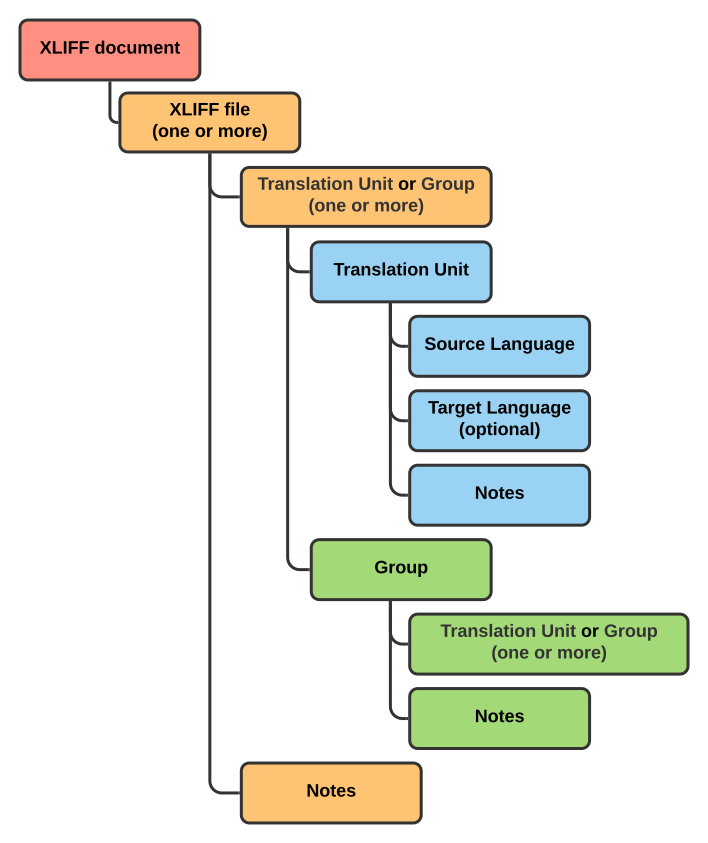
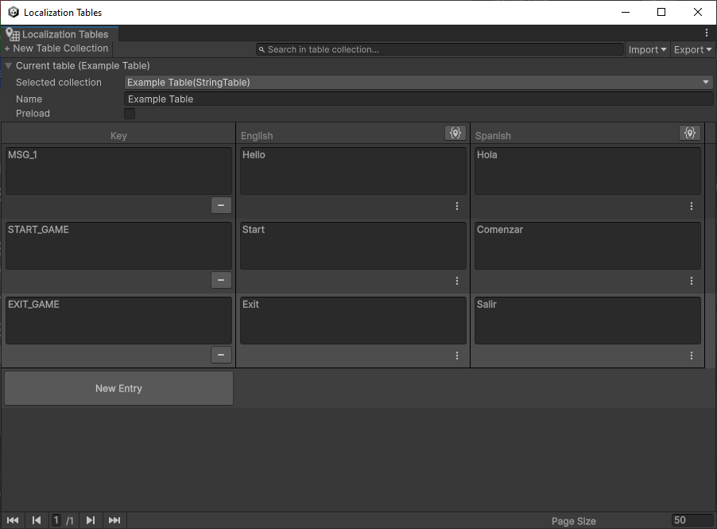
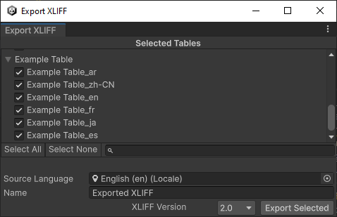
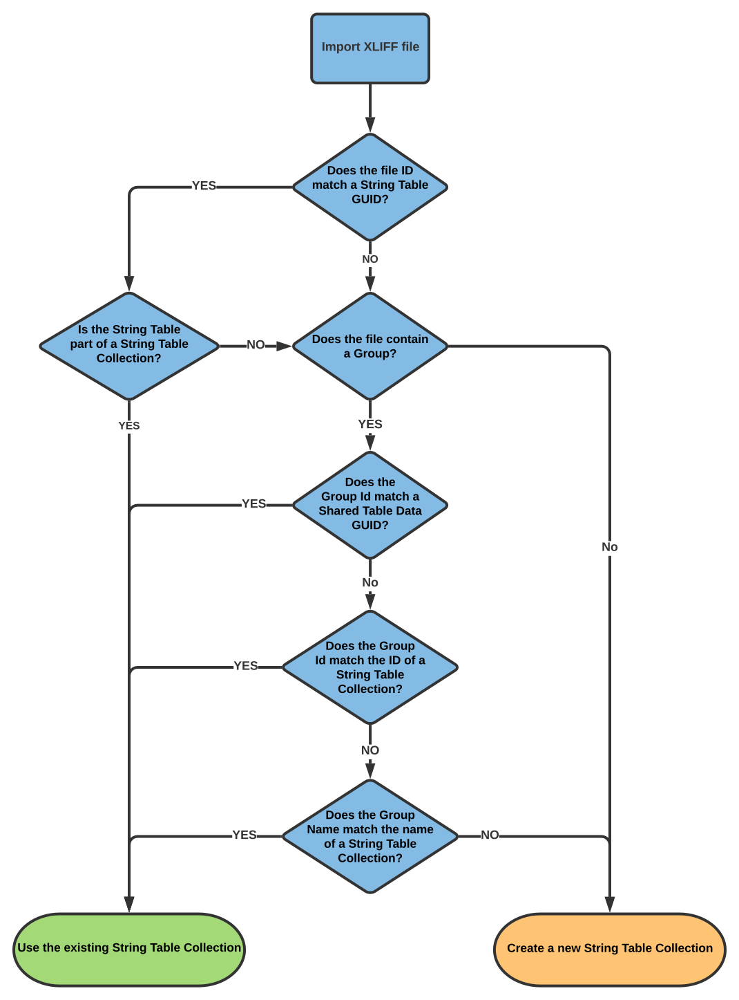
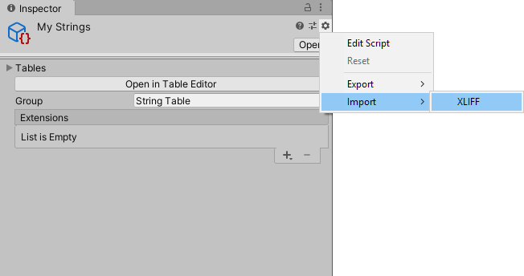
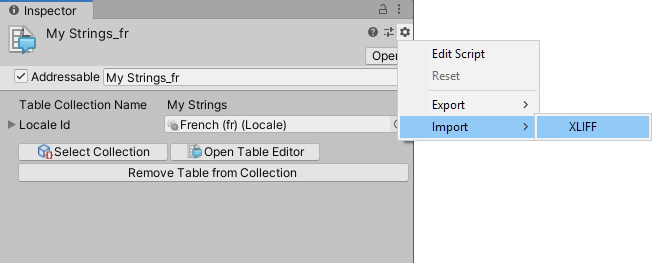

# XLIFF

XML Localisation Interchange File Format (XLIFF) is a standardized way to store localization data. It is supported by many different Computer Aided Translation (CAT) tools, which allows for a smoother translation pipeline when working with translators.

You can export String Table Collections from Unity to one or more XLIFF files, modify them with external CAT tools, and finally re-import them back into Unity with the updated translations.

## XLIFF standard support

The Localization package supports both XLIFF version [1.2](https://docs.oasis-open.org/xliff/v1.2/os/xliff-core.html) and [2.0](https://docs.oasis-open.org/xliff/xliff-core/v2.0/xliff-core-v2.0.html). The API provides a simplified version of the XLIFF standard that works across both versions.You can also access version-specific features in script.

The simplified XLIFF standard has the following structure. See the table below the diagram for details on each node.



An **XLIFF document** contains one or more XLIFF files. Each file contains at least one Translation Unit or Group. It can also contain Notes.

A **Translation Unit** contains one Source Language Table entry and, optionally, one Target Language Table entry. It can also contain Notes.

A **Group** contains at least one Translation Unit or Group. It can also contain Notes.

| **Term** | **Description** |
| ---------| --------------- |
| **File** | A file is the container for localization material extracted from an entire [String Table](StringTables.md). The file contains a reference to the original asset path and its GUID, so that Unity can import any changes to the file back into the same [String Table](StringTables.md).
| **Translation Unit** | A Translation Unit represents an entry taken from a String Table. It contains the source text and the translated text (if it exists). The Translation Unit also contains a name and ID which maps to the Key name and Id, so that when the Localization system re-imports updated translations, it can correctly map them to their table entries.
| **Group** | The XLIFF standard uses Groups as a way to organize units into structured hierarchies. The Localization system treats each String Table Collection as a Group. It uses the **Collection Name** as the Group name, and the Shared Table Data asset **GUID** as the Group Id. This means that when the Localisation system imports an XLIFF file, it can locate and update the original XLIFF Group without additional user input.
| **Notes** | Notes are text that provide further context. When the Localisation system imports an XLIFF file, it generates notes from the Localization Metadata comments and imports them into the XLIFF.<br><br>There are three different Note categories, which indicate the source of the Note:<br><ul><li>**General** - General notes come from the Shared Table Data. They apply to all languages.</li><li>**Source** - Source notes come from the Source Language String Table. They only apply to that language.</li><li>**Target** - Target notes come from the Target Language String Table. They only apply to that language.</li></ul>

### Example XLIFF

The following image demonstrates data in a String Table Collection generated from a XLIFF file, using English as the source language and Spanish as the target language.



The following demonstrates the output for the 2 supported XLIFF versions:

#### **Version 1.2**

```XML
<?xml version="1.0"?>
<xliff xmlns:xsd="http://www.w3.org/2001/XMLSchema" xmlns:xsi="http://www.w3.org/2001/XMLSchema-instance" version="1.2" xmlns="urn:oasis:names:tc:xliff:document:1.2">
  <file original="Assets/Tables/Example Table_es.asset" source-language="en" datatype="plaintext" target-language="es">
    <header>
      <skl>
        <external-file href="Assets/Tables/Example Table_es.asset" uid="8e0d86343d612504c9dda03e44e5026d" />
      </skl>
    </header>
    <body>
      <group id="c56c9f2391765d143baefc05182d5138" resname="Example Table">
        <trans-unit id="6633451520" resname="MSG_1">
          <source>Hello</source>
          <target>Hola</target>
        </trans-unit>
        <trans-unit id="9531715584" resname="START_GAME">
          <source>Start</source>
          <target>Comenzar</target>
        </trans-unit>
        <trans-unit id="15160471552" resname="EXIT_GAME">
          <source>Exit</source>
          <target>Salir</target>
        </trans-unit>
      </group>
    </body>
  </file>
</xliff>
```

#### **Version 2.0**

```XML
<?xml version="1.0"?>
<xliff xmlns:xsd="http://www.w3.org/2001/XMLSchema" xmlns:xsi="http://www.w3.org/2001/XMLSchema-instance" version="2.0" srcLang="en" trgLang="es" xmlns="urn:oasis:names:tc:xliff:document:2.0">
  <file id="8e0d86343d612504c9dda03e44e5026d" original="Assets/Tables/Example Table_es.asset">
    <group id="c56c9f2391765d143baefc05182d5138" name="Example Table">
      <unit id="6633451520" name="MSG_1">
        <segment>
          <source>Hello</source>
          <target>Hola</target>
        </segment>
      </unit>
      <unit id="9531715584" name="START_GAME">
        <segment>
          <source>Start</source>
          <target>Comenzar</target>
        </segment>
      </unit>
      <unit id="15160471552" name="EXIT_GAME">
        <segment>
          <source>Exit</source>
          <target>Salir</target>
        </segment>
      </unit>
    </group>
  </file>
</xliff>
```

## Exporting data to XLIFF

To export data from the Localization system to an XLIFF document, you need to use the Export XLIFF window or the Xliff scripting API.

### Export XLIFF Window

To export to XLIFF open the Localization Tables window (**Window > Asset Management > Localization Tables**) and select **Export/XLIFF...**.

By default, this selects all tables in the window for export.



| **Property** | **Description** |
| ---------| --------------- |
| **Selected Tables** | Use the **Selected Tables** list to configure which String Tables the Localization system should export to XLIFF.
| **Source Language** | Set the **Source Language** to the language you want to set for the XLIFF Translation Unit Source field.<br><br>This does not need to be the original language of the project. For example, a game might be developed in Japanese, but the translator for the Russian localization might require the source language to be English. If an English translation is available, you can set the **Source Language** to English for the Russian language translation XLIFF file.
| **Name** | Set the **Name** to the base file name you want to use for all generated XLIFF files. The Localization system appends this name with the target language code (for example, the name _XliffImportTests_ would become _XliffImportTests-ru_ when exporting Russian).
| **XLIFF Version** | Set the **XLIFF Version** to the XLIFF version that you want to use to generate your XLIFF files. Usually, you should determine this by the software you are importing the generated XLIFF files to. 1.2 is the most commonly supported XLIFF version.
| **Export Selected** | Select the **Export Selected** button when you are ready to export all of the selected tables. Unity prompts you to select a directory to save the generated XLIFF files.

## Importing XLIFF documents

There are several ways you can import XLIFF documents: automatically through the Localization Table window, or via the String Table and String Table Collection windows.

### Automatic import

An automatic XLIFF import attempts to automatically match the XLIFF documents to existing String Table Collections. This method provides a quick way to export data, update it with translations, then re-import the updated data.

To perform an automatic import, open the Localization Tables window and click the **Import** button.

To load all files with the .xlf or .xliff extensions in a given directory and sub-directories, select **XLIFF directory**. To load a single file, select **XLIFF file**.

When Unity imports the XLIFF documents, it also searches for existing String Tables to populate with the data. If Unity created the original XLIFF document, then the assets already have references through their names and GUIDs (see [XLIFF Standard Support](#XLIFF Standard Support). If an external tool created the XLIFF document, then Unity performs the following checks to match it to an existing table:



Unity checks whether the XLIFF file ID matches the String Table ID. If it does, Unity checks whether that String Table is part of a String Table Collection, and if it is, it imports the XLIFF file to that String Table Collection.

If it is not part of a String Table Collection, or if the file ID does not match a String Table GUID, Unity checks whether the file contains a group. If it does not, Unity creates a new String Table Collection. If it does contain a Group, Unity checks whether the Group ID matches a Shared Table Data GUID, and checks whether a String Table Collection exists with the same name as the Group ID or Group name. If it does, Unity imports the XLIFF file to that String Table Collection; if it does not, Unity creates a new String Table Collection.

### Importing into a String Table Collection

To import a XLIFF document into a selected String Table Collection, open the String Table Collection window, select the **More** menu (⋮), and go to **Import > XLIFF**. Unity uses this String Table Collection for all the data in the XLIFF document, and uses a XLIFF file’s **Source Language** and **Target Language** fields to determine which String Tables to update.
You can also do this from the Localization Tables window by selecting  **Import** > **XLIFF into collection**.



### Importing into a String Table

To import XLIFF data directly into a String Table and ignore the XLIFF file’s target language, open the String Table window, select the **More** menu (⋮), and go to **Import > XLIFF**.



## XLIFF API

Unity uses an interface-based layer to provide a simplified API for XLIFF versions 1.2 and 2.0. This layer does not support all XLIFF features; however, if you want to access the features specific to the full version you can cast to the relevant concrete classes.

The following example reads an XLIFF document:

[!code-cs[load-xliff](../DocCodeSamples.Tests/XliffSamples.cs#load-xliff)]

The following example exports and imports an XLIFF file:

[!code-cs[export-xliff](../DocCodeSamples.Tests/XliffSamples.cs#export-xliff)]
